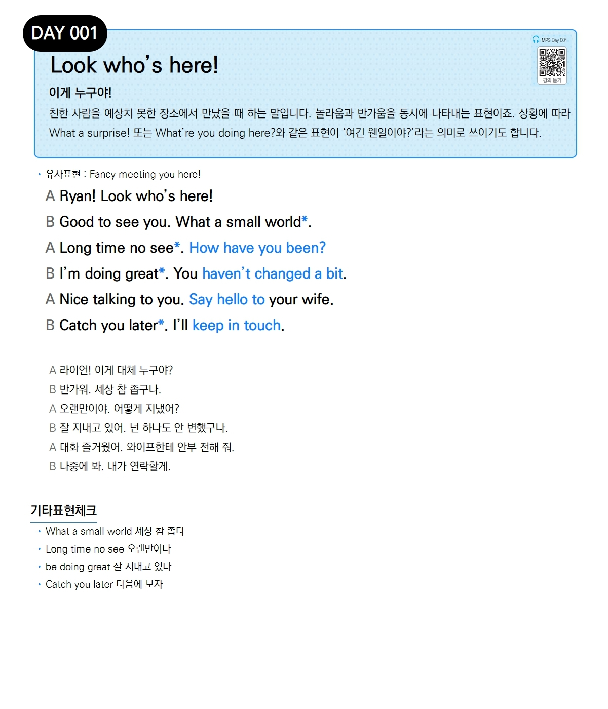

# Day 001 — Look who's here!

> **이게 누구야!**

## 설명
친한 사람을 예상치 못한 장소에서 만났을 때 하는 말입니다. 놀라움과 반가움을 동시에 나타내는 표현이죠. 상황에 따라 **What a surprise!** 또는 **What are you doing here?** 와 같은 표현이 '여긴 웬일이야?'라는 의미로 쓰이기도 합니다.

- **유사표현**: Fancy meeting you here!

## 대화

| | English | 한국어 |
|---|---------|--------|
| A | Ryan! Look who's here! | 라이언! 이게 대체 누구야? |
| B | Good to see you. What a small world. | 반가워. 세상 참 좁구나. |
| A | Long time no see. How have you been? | 오랜만이야. 어떻게 지냈어? |
| B | I'm doing great. You haven't changed a bit. | 잘 지내고 있어. 넌 하나도 안 변했구나. |
| A | Nice talking to you. Say hello to your wife. | 대화 즐거웠어. 와이프한테 안부 전해 줘. |
| B | Catch you later. I'll keep in touch. | 나중에 봐. 내가 연락할게. |

## 기타표현 체크
- **What a small world** 세상 참 좁다
- **Long time no see** 오랜만이다
- **be doing great** 잘 지내고 있다
- **Catch you later** 다음에 보자
