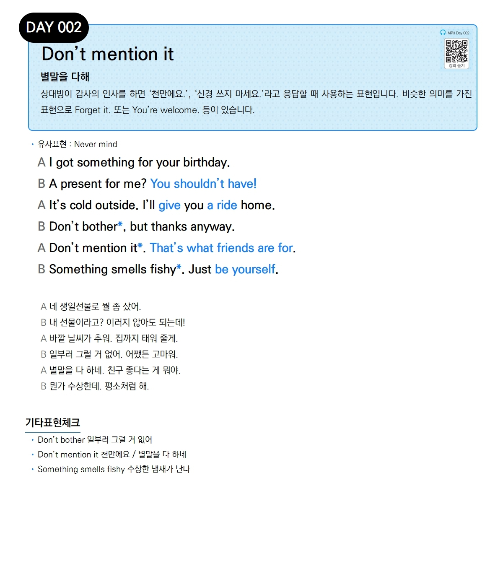

# Day 002 — Don't mention it

> **별말을 다해**

## 설명
상대방이 감사의 인사를 하면 '천만에요.', '신경 쓰지 마세요.'라고 응답할 때 사용하는 표현입니다. 비슷한 의미를 가진 표현으로 **Forget it.** 또는 **You're welcome.** 등이 있습니다.

- **유사표현**: Never mind

## 대화

| | English | 한국어 |
|---|---------|--------|
| A | I got something for your birthday. | 네 생일선물로 뭘 좀 샀어. |
| B | A present for me? You shouldn't have! | 내 선물이라고? 이러지 않아도 되는데! |
| A | It's cold outside. I'll give you a ride home. | 바깥 날씨가 추워. 집까지 태워 줄게. |
| B | Don't bother, but thanks anyway. | 일부러 그럴 거 없어. 어쨌든 고마워. |
| A | Don't mention it. That's what friends are for. | 별말을 다 하네. 친구 좋다는 게 뭐야. |
| B | Something smells fishy. Just be yourself. | 뭔가 수상한데. 평소처럼 해. |

## 기타표현 체크
- **Don't bother** 일부러 그럴 거 없어
- **Don't mention it** 천만에요 / 별말을 다 하네
- **Something smells fishy** 수상한 냄새가 난다
