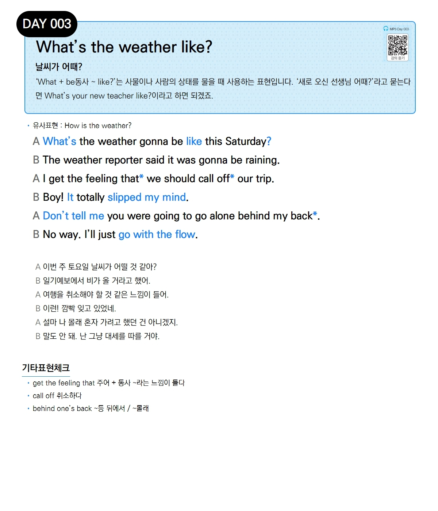

# Day 003 — What's the weather like?

> **날씨가 어때?**

## 설명
'**What + be동사 ~ like?**'는 사물이나 사람의 상태를 물을 때 사용하는 표현입니다. '새로 오신 선생님 어때?'라고 묻는다면 **What's your new teacher like?**이라고 하면 되겠죠.

- **유사표현**: How is the weather?

## 대화

| | English | 한국어 |
|---|---------|--------|
| A | What's the weather gonna be like this Saturday? | 이번 주 토요일 날씨가 어떨 것 같아? |
| B | The weather reporter said it was gonna be raining. | 일기예보에서 비가 올 거라고 했어. |
| A | I get the feeling that we should call off our trip. | 여행을 취소해야 할 것 같은 느낌이 들어. |
| B | Boy! It totally slipped my mind. | 이런! 깜빡 잊고 있었네. |
| A | Don't tell me you were going to go alone behind my back. | 설마 나 몰래 혼자 가려고 했던 건 아니겠지. |
| B | No way. I'll just go with the flow. | 말도 안 돼. 난 그냥 대세를 따를 거야. |

## 기타표현 체크
- **get the feeling that** 주어 + 동사 ~라는 느낌이 들다
- **call off** 취소하다
- **behind one's back** ~등 뒤에서 / ~몰래
