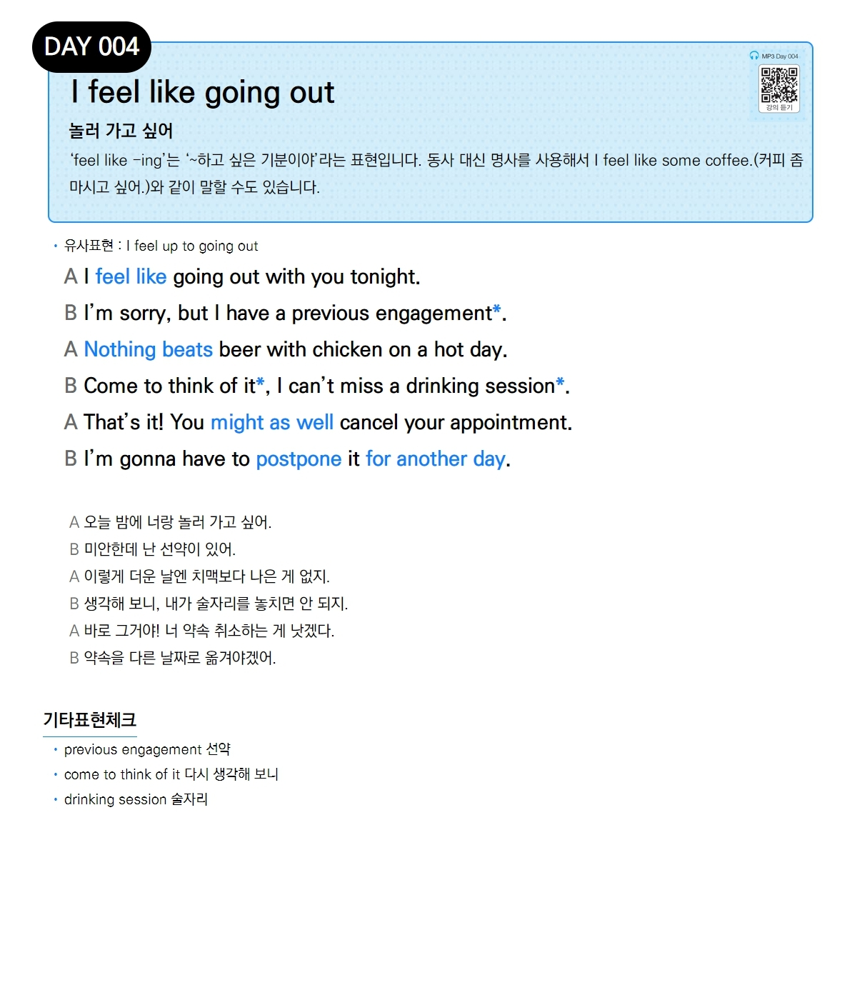

# Day 004 — I feel like going out

> **놀러 가고 싶어**

## 설명
'**feel like -ing**'는 '~하고 싶은 기분이야'라는 표현입니다. 동사 대신 명사를 사용해서 **I feel like some coffee.**(커피 좀 마시고 싶어.)와 같이 말할 수도 있습니다.

- **유사표현**: I feel up to going out

## 대화

| | English | 한국어 |
|---|---------|--------|
| A | I feel like going out with you tonight. | 오늘 밤에 너랑 놀러 가고 싶어. |
| B | I'm sorry, but I have a previous engagement. | 미안한데 난 선약이 있어. |
| A | Nothing beats beer with chicken on a hot day. | 이렇게 더운 날엔 치맥보다 나은 게 없지. |
| B | Come to think of it, I can't miss a drinking session. | 생각해 보니, 내가 술자리를 놓치면 안 되지. |
| A | That's it! You might as well cancel your appointment. | 바로 그거야! 너 약속 취소하는 게 낫겠다. |
| B | I'm gonna have to postpone it for another day. | 약속을 다른 날짜로 옮겨야겠어. |

## 기타표현 체크
- **previous engagement** 선약
- **come to think of it** 다시 생각해 보니
- **drinking session** 술자리
