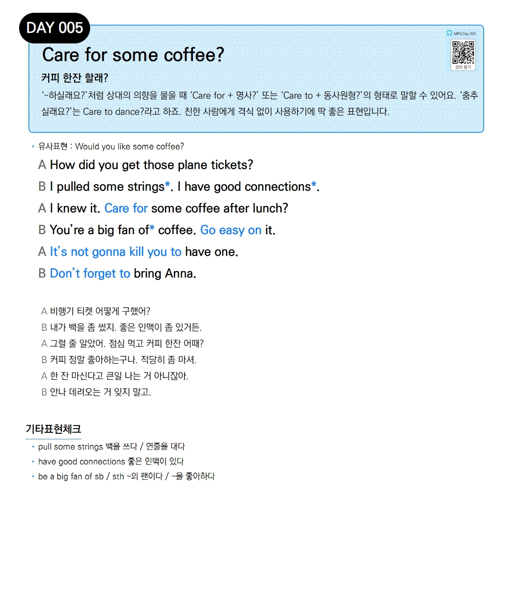

# Day 005 — Care for some coffee?

> **커피 한잔 할래?**

## 설명
'~하실래요?'처럼 상대의 의향을 물을 때 'Care for + 명사?' 또는 'Care to + 동사원형?'의 형태로 말할 수 있어요. '춤추실래요?'는 Care to dance?라고 하죠. 친한 사람에게 격식 없이 사용하기에 딱 좋은 표현입니다.

- **유사표현**: Would you like some coffee?

## 대화

| | English | 한국어 |
|---|---------|--------|
| A | How did you get those plane tickets? | 비행기 티켓 어떻게 구했어? |
| B | I pulled some strings*. I have good connections*. | 내가 백을 좀 썼지. 좋은 인맥이 좀 있거든. |
| A | I knew it. Care for some coffee after lunch? | 그럴 줄 알았어. 점심 먹고 커피 한잔 어때? |
| B | You're a big fan of* coffee. Go easy on it. | 커피 정말 좋아하는구나. 적당히 좀 마셔. |
| A | It's not gonna kill you to have one. | 한 잔 마신다고 큰일 나는 거 아니잖아. |
| B | Don't forget to bring Anna. | 안나 데려오는 거 잊지 말고. |

## 기타표현 체크
- **pull some strings** 백을 쓰다 / 연줄을 대다
- **have good connections** 좋은 인맥이 있다
- **be a big fan of sb / sth** ~의 팬이다 / ~을 좋아하다
