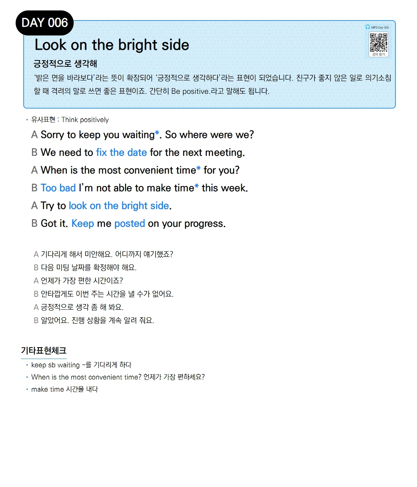

# Day 006 — Look on the bright side

> **긍정적으로 생각해**

## 설명
'밝은 면을 바라보다'라는 뜻이 확장되어 '긍정적으로 생각하다'라는 표현이 되었습니다. 친구가 좋지 않은 일로 의기소침할 때 격려의 말로 쓰면 좋은 표현이죠. 간단히 Be positive.라고 말해도 됩니다.

- **유사표현**: Think positively

## 대화

| | English | 한국어 |
|---|---------|--------|
| A | Sorry to keep you waiting*. So where were we? | 기다리게 해서 미안해요. 어디까지 얘기했죠? |
| B | We need to fix the date for the next meeting. | 다음 미팅 날짜를 확정해야 해요. |
| A | When is the most convenient time* for you? | 언제가 가장 편한 시간이죠? |
| B | Too bad I'm not able to make time* this week. | 안타깝게도 이번 주는 시간을 낼 수가 없어요. |
| A | Try to look on the bright side. | 긍정적으로 생각 좀 해 봐요. |
| B | Got it. Keep me posted on your progress. | 알았어요. 진행 상황을 계속 알려 줘요. |

## 기타표현 체크
- **keep sb waiting** ~를 기다리게 하다
- **When is the most convenient time?** 언제가 가장 편하세요?
- **make time** 시간을 내다
