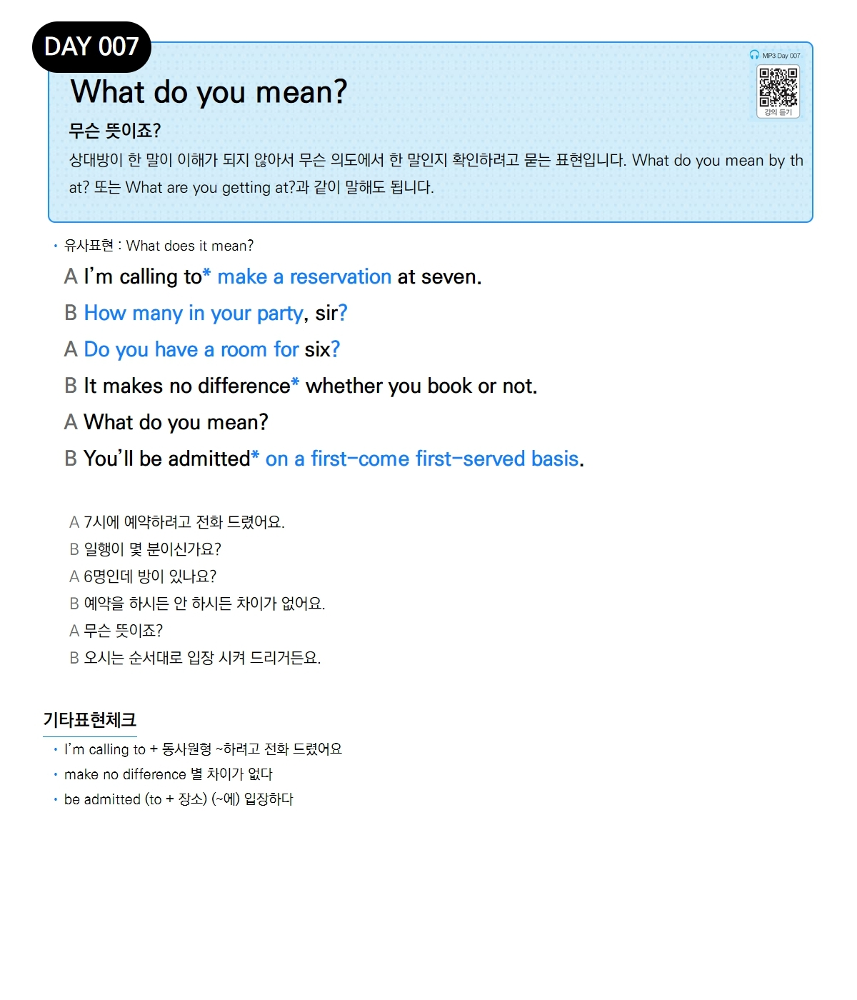

# Day 007 — What do you mean?

> **무슨 뜻이죠?**

## 설명
상대방이 한 말이 이해가 되지 않아서 무슨 의도에서 한 말인지 확인하려고 묻는 표현입니다. What do you mean by that? 또는 What are you getting at?과 같이 말해도 됩니다.

- **유사표현**: What does it mean?

## 대화

| | English | 한국어 |
|---|---------|--------|
| A | I'm calling to make a reservation at seven. | 7시에 예약하려고 전화 드렸어요. |
| B | How many in your party, sir? | 일행이 몇 분이신가요? |
| A | Do you have a room for six? | 6명인데 방이 있나요? |
| B | It makes no difference whether you book or not. | 예약을 하시든 안 하시든 차이가 없어요. |
| A | What do you mean? | 무슨 뜻이죠? |
| B | You'll be admitted on a first-come first-served basis. | 오시는 순서대로 입장 시켜 드리거든요. |

## 기타표현 체크
- **I'm calling to + 동사원형** ~하려고 전화 드렸어요
- **make no difference** 별 차이가 없다
- **be admitted (to + 장소)** (~에) 입장하다
