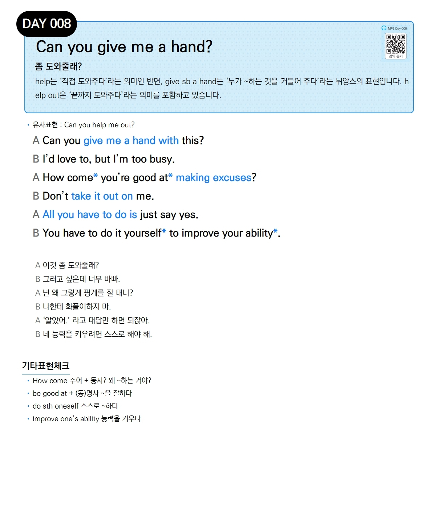

# Day 008 — Can you give me a hand?

> **좀 도와줄래?**

## 설명
`help`는 '직접 도와주다'라는 의미인 반면, `give sb a hand`는 '누가 ~하는 것을 거들어 주다'라는 뉘앙스의 표현입니다. `help out`은 '끝까지 도와주다'라는 의미를 포함하고 있습니다.

- **유사표현**: Can you help me out?

## 대화

| | English | 한국어 |
|---|---------|--------|
| A | Can you give me a hand with this? | 이것 좀 도와줄래? |
| B | I'd love to, but I'm too busy. | 그러고 싶은데 너무 바빠. |
| A | How come you're good at making excuses? | 넌 왜 그렇게 핑계를 잘 대니? |
| B | Don't take it out on me. | 나한테 화풀이하지 마. |
| A | All you have to do is just say yes. | '알았어.'라고 대답만 하면 되잖아. |
| B | You have to do it yourself to improve your ability. | 네 능력을 키우려면 스스로 해야 해. |

## 기타표현 체크
- **How come 주어 + 동사?** 왜 ~하는 거야?
- **be good at + (동)명사** ~을 잘하다
- **do sth oneself** 스스로 ~하다
- **improve one's ability** 능력을 키우다
