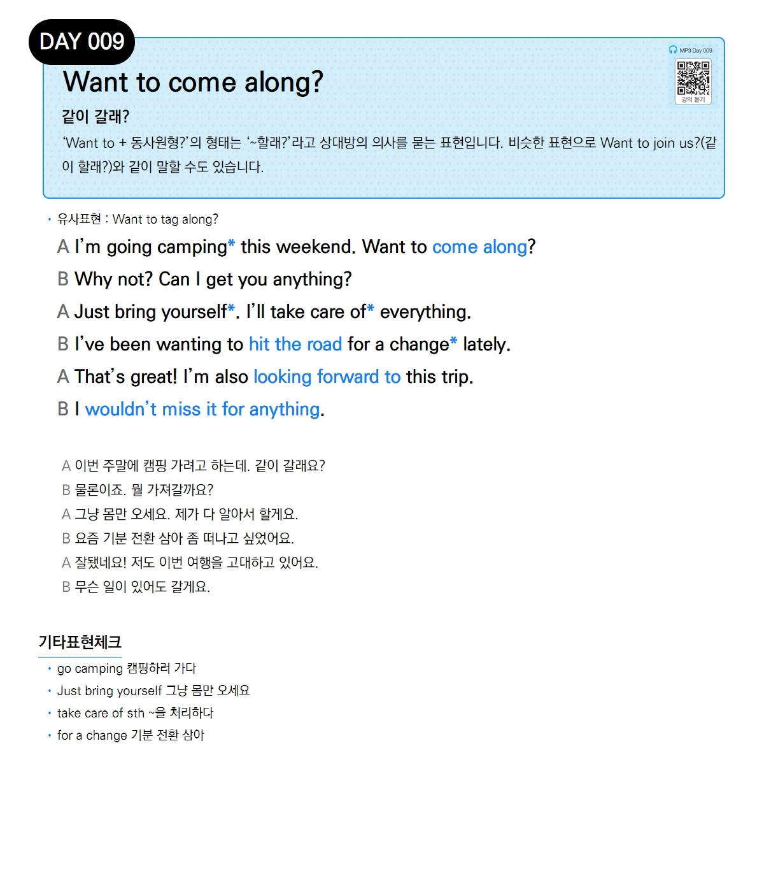

# Day 009 — Want to come along?

> **같이 갈래?**

## 설명
`Want to + 동사원형?`의 형태는 '~할래?'라고 상대방의 의사를 묻는 표현입니다. 비슷한 표현으로 `Want to join us?`(같이 할래?)와 같이 말할 수도 있습니다.

- **유사표현**: Want to tag along?

## 대화

| | English | 한국어 |
|---|---------|--------|
| A | I'm going camping this weekend. Want to come along? | 이번 주말에 캠핑 가려고 하는데. 같이 갈래요? |
| B | Why not? Can I get you anything? | 물론이죠. 뭘 가져갈까요? |
| A | Just bring yourself. I'll take care of everything. | 그냥 몸만 오세요. 제가 다 알아서 할게요. |
| B | I've been wanting to hit the road for a change lately. | 요즘 기분 전환 삼아 좀 떠나고 싶었어요. |
| A | That's great! I'm also looking forward to this trip. | 잘됐네요! 저도 이번 여행을 고대하고 있어요. |
| B | I wouldn't miss it for anything. | 무슨 일이 있어도 갈게요. |

## 기타표현 체크
- **go camping** 캠핑하러 가다
- **Just bring yourself** 그냥 몸만 오세요
- **take care of sth** ~을 처리하다
- **for a change** 기분 전환 삼아
