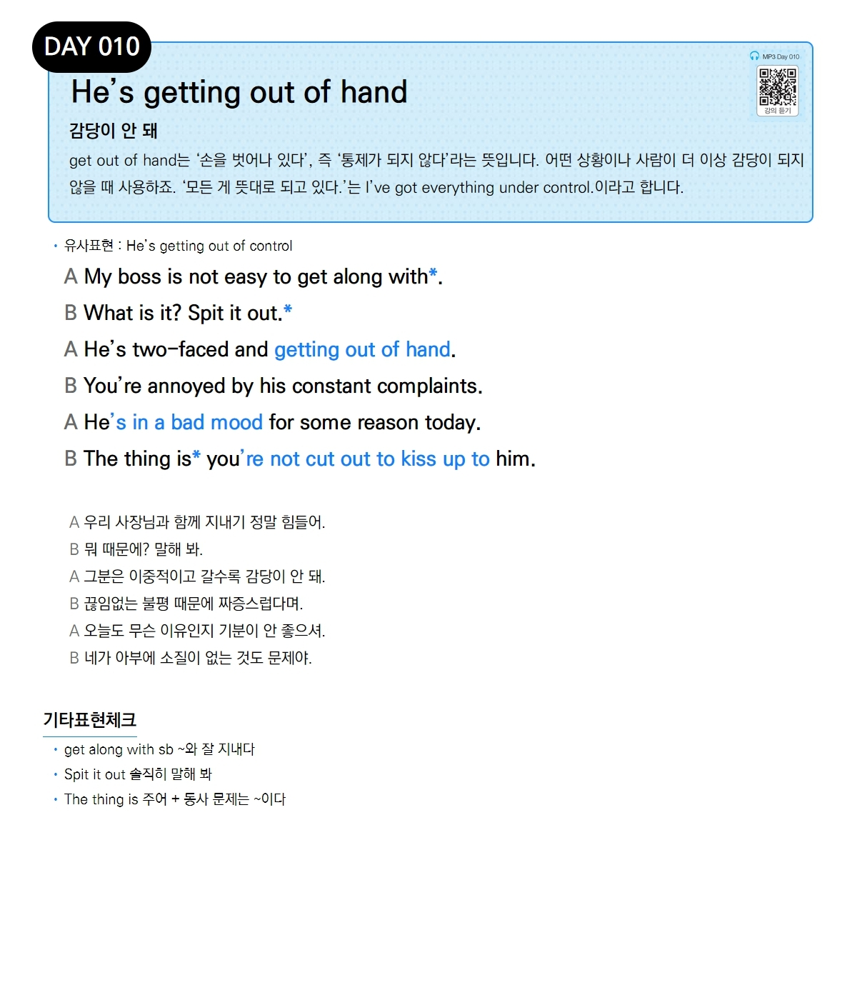

# Day 010 — He's getting out of hand

> **감당이 안 돼**

## 설명
`get out of hand`는 '손을 벗어나 있다', 즉 '통제가 되지 않다'라는 뜻입니다. 어떤 상황이나 사람이 더 이상 감당이 되지 않을 때 사용하죠. '모든 게 뜻대로 되고 있다.'는 `I've got everything under control.`이라고 합니다.

- **유사표현**: He's getting out of control

## 대화

| | English | 한국어 |
|---|---------|--------|
| A | My boss is not easy to get along with. | 우리 사장님과 함께 지내기 정말 힘들어. |
| B | What is it? Spit it out. | 뭐 때문에? 말해 봐. |
| A | He's two-faced and getting out of hand. | 그분은 이중적이고 갈수록 감당이 안 돼. |
| B | You're annoyed by his constant complaints. | 끊임없는 불평 때문에 짜증스럽다며. |
| A | He's in a bad mood for some reason today. | 오늘도 무슨 이유인지 기분이 안 좋으셔. |
| B | The thing is you're not cut out to kiss up to him. | 네가 아부에 소질이 없는 것도 문제야. |

## 기타표현 체크
- **get along with sb** ~와 잘 지내다
- **Spit it out** 솔직히 말해 봐
- **The thing is 주어 + 동사** 문제는 ~이다
