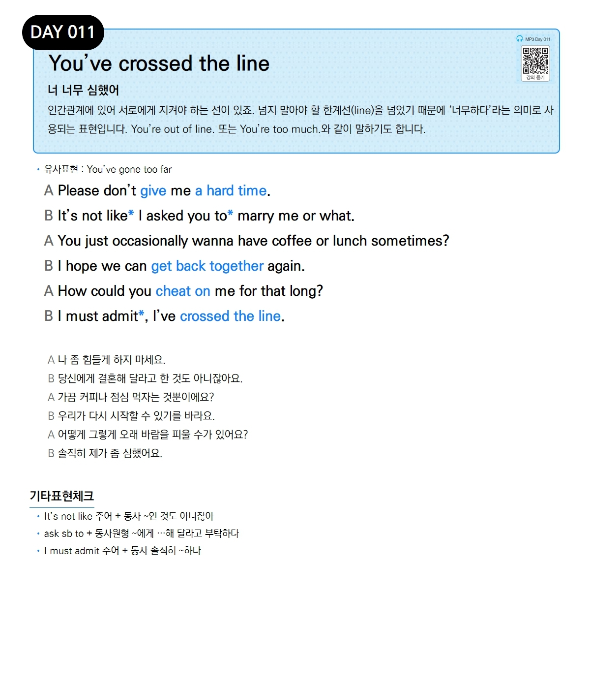

# Day 011 — You've crossed the line

> **너 너무 심했어**

## 설명
인간관계에 있어 서로에게 지켜야 하는 선이 있죠. 넘지 말아야 할 한계선(line)을 넘었기 때문에 '너무하다'라는 의미로 사용되는 표현입니다. You're out of line. 또는 You're too much.와 같이 말하기도 합니다.

- **유사표현**: You've gone too far

## 대화

| | English | 한국어 |
|---|---------|--------|
| A | Please don't give me a hard time. | 나 좀 힘들게 하지 마세요. |
| B | It's not like I asked you to marry me or what. | 당신에게 결혼해 달라고 한 것도 아니잖아요. |
| A | You just occasionally wanna have coffee or lunch sometimes? | 가끔 커피나 점심 먹자는 것뿐이에요? |
| B | I hope we can get back together again. | 우리가 다시 시작할 수 있기를 바라요. |
| A | How could you cheat on me for that long? | 어떻게 그렇게 오래 바람을 피울 수가 있어요? |
| B | I must admit, I've crossed the line. | 솔직히 제가 좀 심했어요. |

## 기타표현 체크
- **It's not like 주어 + 동사** ~인 것도 아니잖아
- **ask sb to + 동사원형** ~에게 …해 달라고 부탁하다
- **I must admit 주어 + 동사** 솔직히 ~하다
