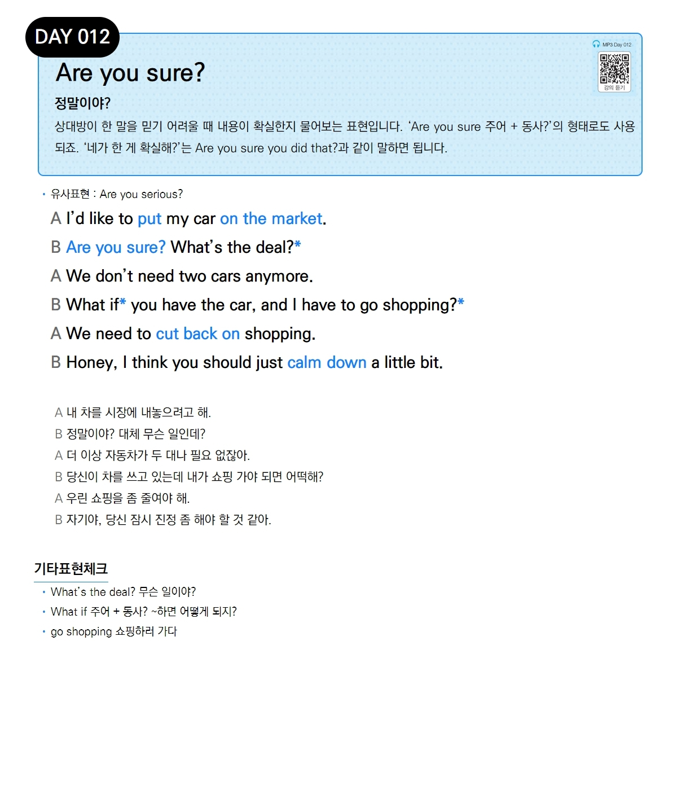

# Day 012 — Are you sure?

> **정말이야?**

## 설명
상대방이 한 말을 믿기 어려울 때 내용이 확실한지 물어보는 표현입니다. 'Are you sure 주어 + 동사?'의 형태로도 사용되죠. '네가 한 게 확실해?'는 Are you sure you did that?과 같이 말하면 됩니다.

- **유사표현**: Are you serious?

## 대화

| | English | 한국어 |
|---|---------|--------|
| A | I'd like to put my car on the market. | 내 차를 시장에 내놓으려고 해. |
| B | Are you sure? What's the deal? | 정말이야? 대체 무슨 일인데? |
| A | We don't need two cars anymore. | 더 이상 자동차가 두 대나 필요 없잖아. |
| B | What if you have the car, and I have to go shopping? | 당신이 차를 쓰고 있는데 내가 쇼핑 가야 되면 어떡해? |
| A | We need to cut back on shopping. | 우린 쇼핑을 좀 줄여야 해. |
| B | Honey, I think you should just calm down a little bit. | 자기야, 당신 잠시 진정 좀 해야 할 것 같아. |

## 기타표현 체크
- **What's the deal?** 무슨 일이야?
- **What if 주어 + 동사?** ~하면 어떻게 되지?
- **go shopping** 쇼핑하러 가다
