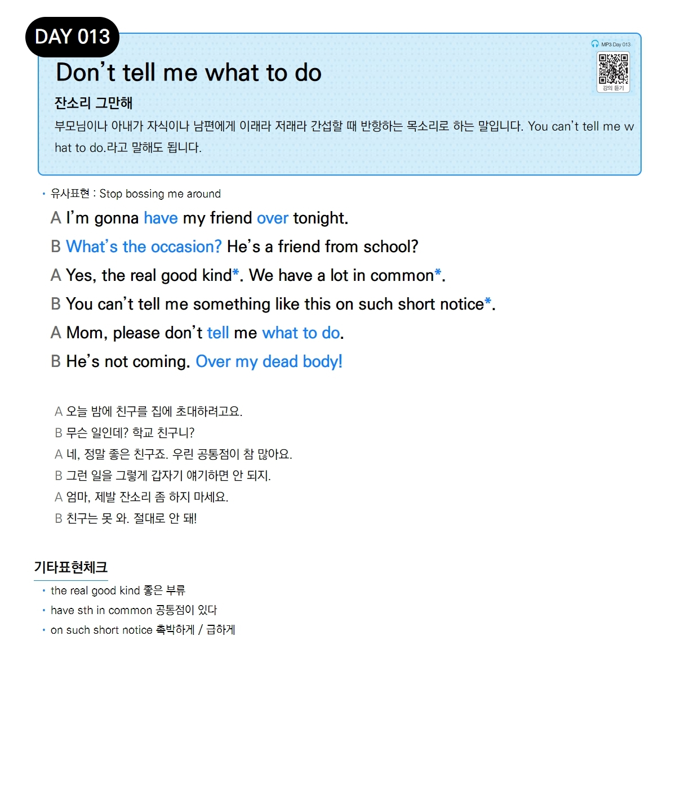

# Day 013 — Don't tell me what to do

> **잔소리 그만해**

## 설명
부모님이나 아내가 자식이나 남편에게 이래라 저래라 간섭할 때 반항하는 목소리로 하는 말입니다. You can't tell me what to do.라고 말해도 됩니다.

- **유사표현**: Stop bossing me around

## 대화

| | English | 한국어 |
|---|---------|--------|
| A | I'm gonna have my friend over tonight. | 오늘 밤에 친구를 집에 초대하려고요. |
| B | What's the occasion? He's a friend from school? | 무슨 일인데? 학교 친구니? |
| A | Yes, the real good kind. We have a lot in common. | 네, 정말 좋은 친구죠. 우린 공통점이 참 많아요. |
| B | You can't tell me something like this on such short notice. | 그런 일을 그렇게 갑자기 얘기하면 안 되지. |
| A | Mom, please don't tell me what to do. | 엄마, 제발 잔소리 좀 하지 마세요. |
| B | He's not coming. Over my dead body! | 친구는 못 와. 절대로 안 돼! |

## 기타표현 체크
- **the real good kind** 좋은 부류
- **have sth in common** 공통점이 있다
- **on such short notice** 촉박하게 / 급하게
