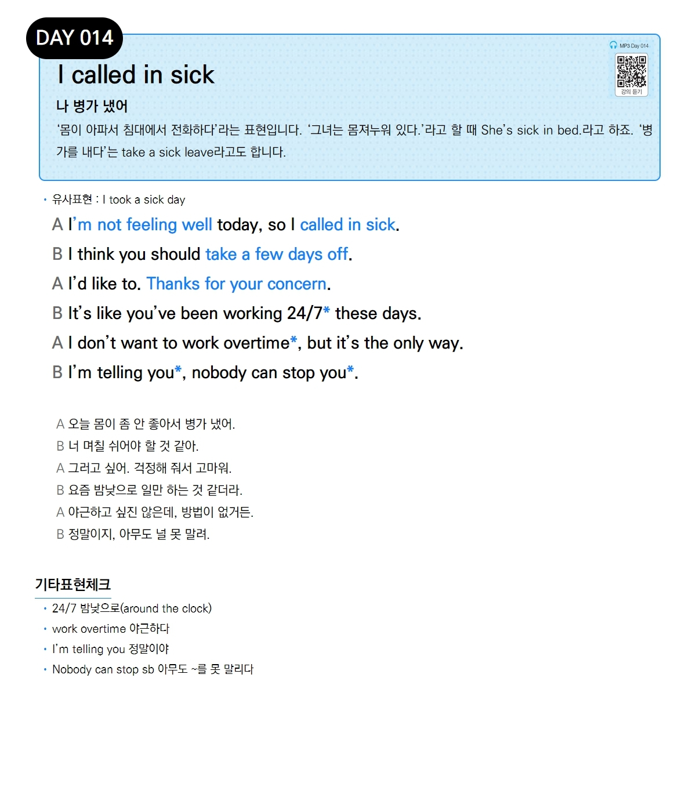

# Day 014 — I called in sick

> **나 병가 냈어**

## 설명
'몸이 아파서 침대에서 전화하다'라는 표현입니다. '그녀는 몸져누워 있다.'라고 할 때 She's sick in bed.라고 하죠. '병가를 내다'는 take a sick leave라고도 합니다.

- **유사표현**: I took a sick day

## 대화

| | English | 한국어 |
|---|---------|--------|
| A | I'm not feeling well today, so I called in sick. | 오늘 몸이 좀 안 좋아서 병가 냈어. |
| B | I think you should take a few days off. | 너 며칠 쉬어야 할 것 같아. |
| A | I'd like to. Thanks for your concern. | 그러고 싶어. 걱정해 줘서 고마워. |
| B | It's like you've been working 24/7 these days. | 요즘 밤낮으로 일만 하는 것 같더라. |
| A | I don't want to work overtime, but it's the only way. | 야근하고 싶진 않은데, 방법이 없거든. |
| B | I'm telling you, nobody can stop you. | 정말이지, 아무도 널 못 말려. |

## 기타표현 체크
- **24/7** 밤낮으로(around the clock)
- **work overtime** 야근하다
- **I'm telling you** 정말이야
- **Nobody can stop sb** 아무도 ~를 못 말리다
