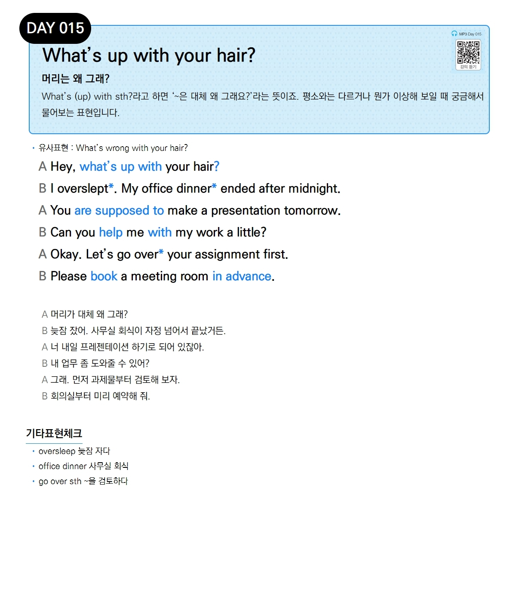

# Day 015 — What's up with your hair?

> **머리는 왜 그래?**

## 설명
What's (up) with sth?라고 하면 '~은 대체 왜 그래요?'라는 뜻이죠. 평소와는 다르거나 뭔가 이상해 보일 때 궁금해서 물어보는 표현입니다.

- **유사표현**: What's wrong with your hair?

## 대화

| | English | 한국어 |
|---|---------|--------|
| A | Hey, what's up with your hair? | 머리가 대체 왜 그래? |
| B | I overslept. My office dinner ended after midnight. | 늦잠 잤어. 사무실 회식이 자정 넘어서 끝났거든. |
| A | You are supposed to make a presentation tomorrow. | 너 내일 프레젠테이션 하기로 되어 있잖아. |
| B | Can you help me with my work a little? | 내 업무 좀 도와줄 수 있어? |
| A | Okay. Let's go over your assignment first. | 그래. 먼저 과제물부터 검토해 보자. |
| B | Please book a meeting room in advance. | 회의실부터 미리 예약해 줘. |

## 기타표현 체크
- **oversleep** 늦잠 자다
- **office dinner** 사무실 회식
- **go over sth** ~을 검토하다
