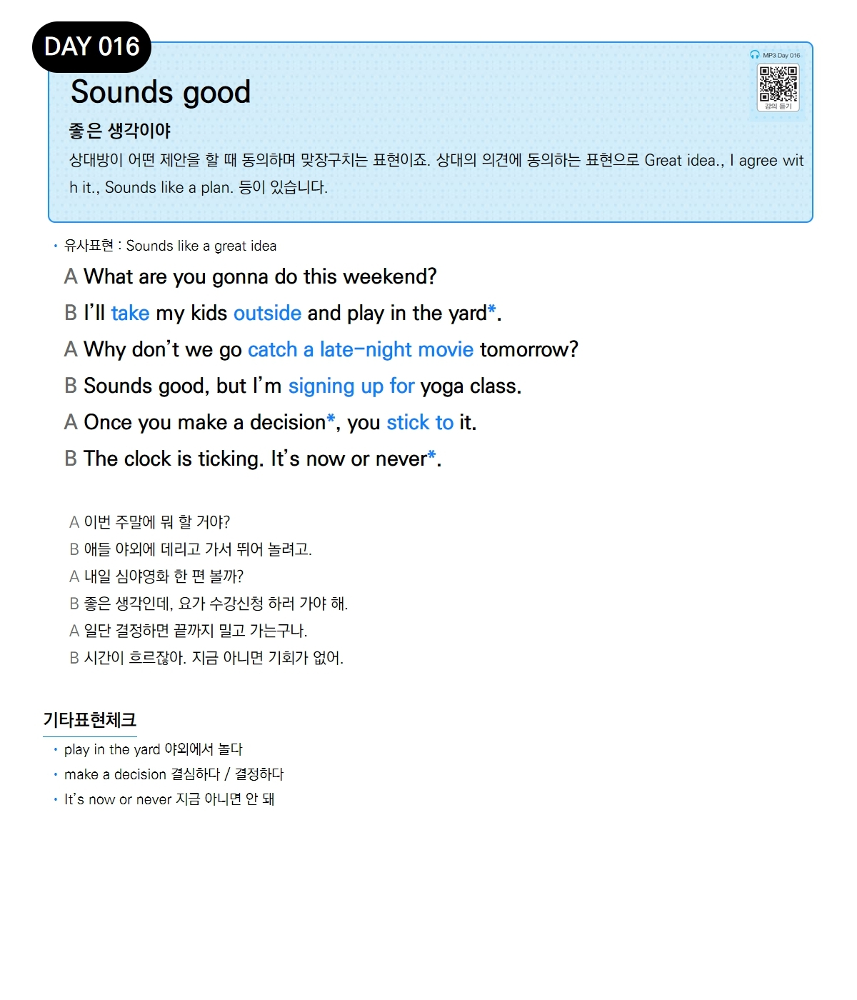

# Day 016 — Sounds good

> **좋은 생각이야**

## 설명
상대방이 어떤 제안을 할 때 동의하며 맞장구치는 표현이죠. 상대의 의견에 동의하는 표현으로 Great idea., I agree with it., Sounds like a plan. 등이 있습니다.

- **유사표현**: Sounds like a great idea

## 대화

| | English | 한국어 |
|---|---------|--------|
| A | What are you gonna do this weekend? | 이번 주말에 뭐 할 거야? |
| B | I'll take my kids outside and play in the yard. | 애들 야외에 데리고 가서 뛰어 놀려고. |
| A | Why don't we go catch a late-night movie tomorrow? | 내일 심야영화 한 편 볼까? |
| B | Sounds good, but I'm signing up for yoga class. | 좋은 생각인데, 요가 수강신청 하러 가야 해. |
| A | Once you make a decision, you stick to it. | 일단 결정하면 끝까지 밀고 가는구나. |
| B | The clock is ticking. It's now or never. | 시간이 흐르잖아. 지금 아니면 기회가 없어. |

## 기타표현 체크
- **play in the yard** 야외에서 놀다
- **make a decision** 결심하다 / 결정하다
- **It's now or never** 지금 아니면 안 돼
