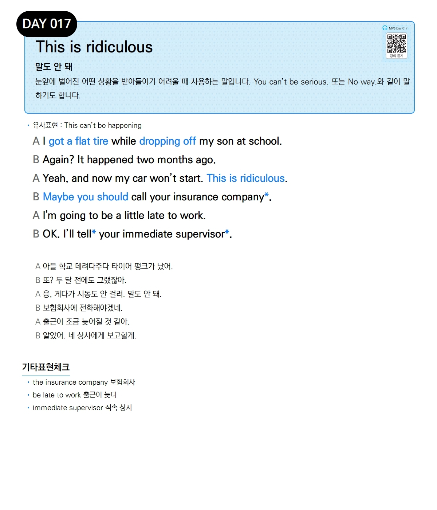

# Day 017 — This is ridiculous

> **말도 안 돼**

## 설명
눈앞에 벌어진 어떤 상황을 받아들이기 어려울 때 사용하는 말입니다. You can't be serious. 또는 No way.와 같이 말하기도 합니다.

- **유사표현**: This can't be happening

## 대화

| | English | 한국어 |
|---|---------|--------|
| A | I got a flat tire while dropping off my son at school. | 아들 학교 데려다주다 타이어 펑크가 났어. |
| B | Again? It happened two months ago. | 또? 두 달 전에도 그랬잖아. |
| A | Yeah, and now my car won't start. This is ridiculous. | 응, 게다가 시동도 안 걸려. 말도 안 돼. |
| B | Maybe you should call your insurance company. | 보험회사에 전화해야겠네. |
| A | I'm going to be a little late to work. | 출근이 조금 늦어질 것 같아. |
| B | OK. I'll tell your immediate supervisor. | 알았어. 네 상사에게 보고할게. |

## 기타표현 체크
- **the insurance company** 보험회사
- **be late to work** 출근이 늦다
- **immediate supervisor** 직속 상사
