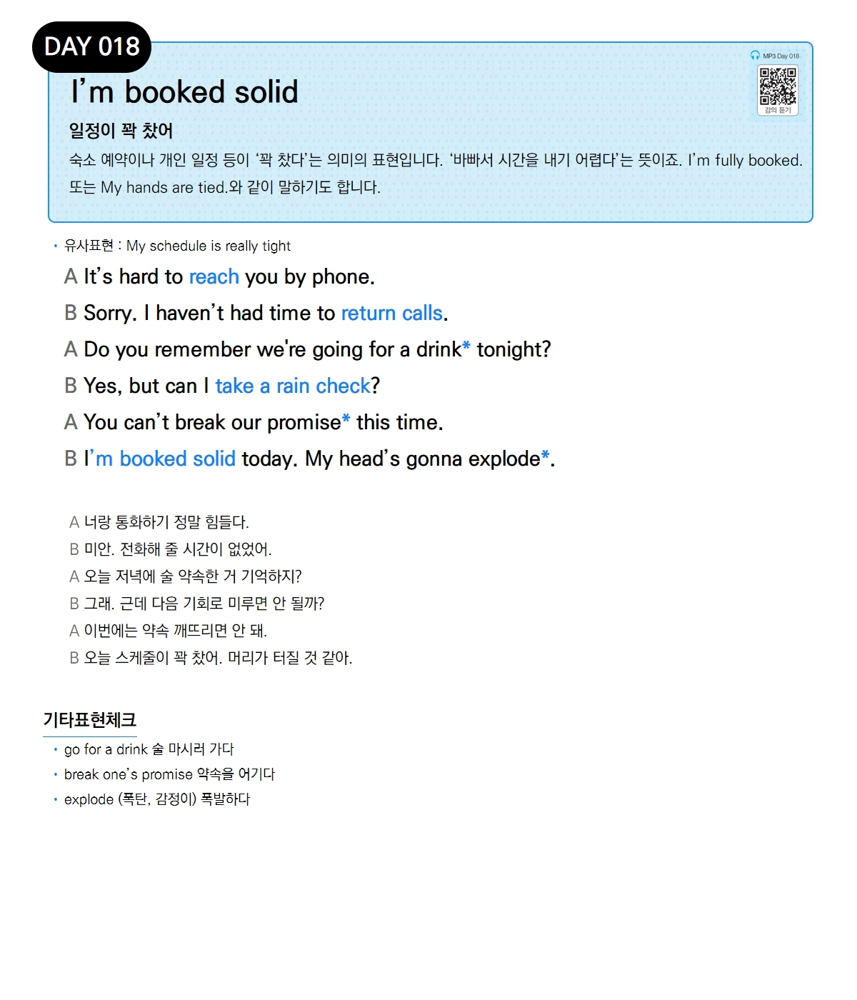

# Day 018 — I'm booked solid

> **일정이 꽉 찼어**

## 설명
숙소 예약이나 개인 일정 등이 '꽉 찼다'는 의미의 표현입니다. '바빠서 시간을 내기 어렵다'는 뜻이죠. I'm fully booked. 또는 My hands are tied.와 같이 말하기도 합니다.

- **유사표현**: My schedule is really tight

## 대화

| | English | 한국어 |
|---|---------|--------|
| A | It's hard to reach you by phone. | 너랑 통화하기 정말 힘들다. |
| B | Sorry. I haven't had time to return calls. | 미안. 전화해 줄 시간이 없었어. |
| A | Do you remember we're going for a drink tonight? | 오늘 저녁에 술 약속한 거 기억하지? |
| B | Yes, but can I take a rain check? | 그래. 근데 다음 기회로 미루면 안 될까? |
| A | You can't break our promise this time. | 이번에는 약속 깨뜨리면 안 돼. |
| B | I'm booked solid today. My head's gonna explode. | 오늘 스케줄이 꽉 찼어. 머리가 터질 것 같아. |

## 기타표현 체크
- **go for a drink** 술 마시러 가다
- **break one's promise** 약속을 어기다
- **explode** (폭탄, 감정이) 폭발하다
