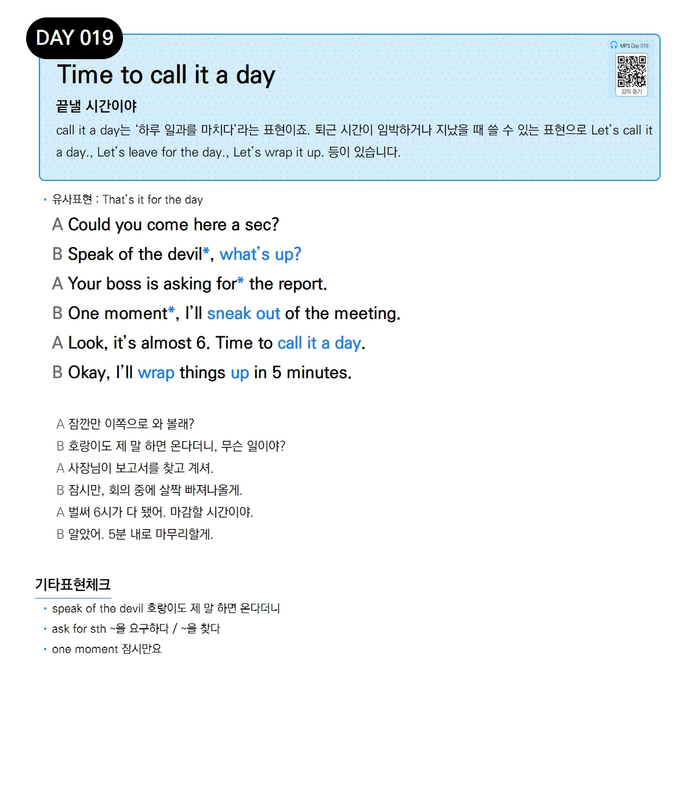

# Day 019 — Time to call it a day

> **끝낼 시간이야**

## 설명
call it a day는 '하루 일과를 마치다'라는 표현이죠. 퇴근 시간이 임박하거나 지났을 때 쓸 수 있는 표현으로 Let's call it a day., Let's leave for the day., Let's wrap it up. 등이 있습니다.

- **유사표현**: That's it for the day

## 대화

| | English | 한국어 |
|---|---------|--------|
| A | Could you come here a sec? | 잠깐만 이쪽으로 와 볼래? |
| B | Speak of the devil, what's up? | 호랑이도 제 말 하면 온다더니, 무슨 일이야? |
| A | Your boss is asking for the report. | 사장님이 보고서를 찾고 계셔. |
| B | One moment, I'll sneak out of the meeting. | 잠시만, 회의 중에 살짝 빠져나올게. |
| A | Look, it's almost 6. Time to call it a day. | 벌써 6시가 다 됐어. 마감할 시간이야. |
| B | Okay, I'll wrap things up in 5 minutes. | 알았어. 5분 내로 마무리할게. |

## 기타표현 체크
- **speak of the devil** 호랑이도 제 말 하면 온다더니
- **ask for sth** ~을 요구하다 / ~을 찾다
- **one moment** 잠시만요
