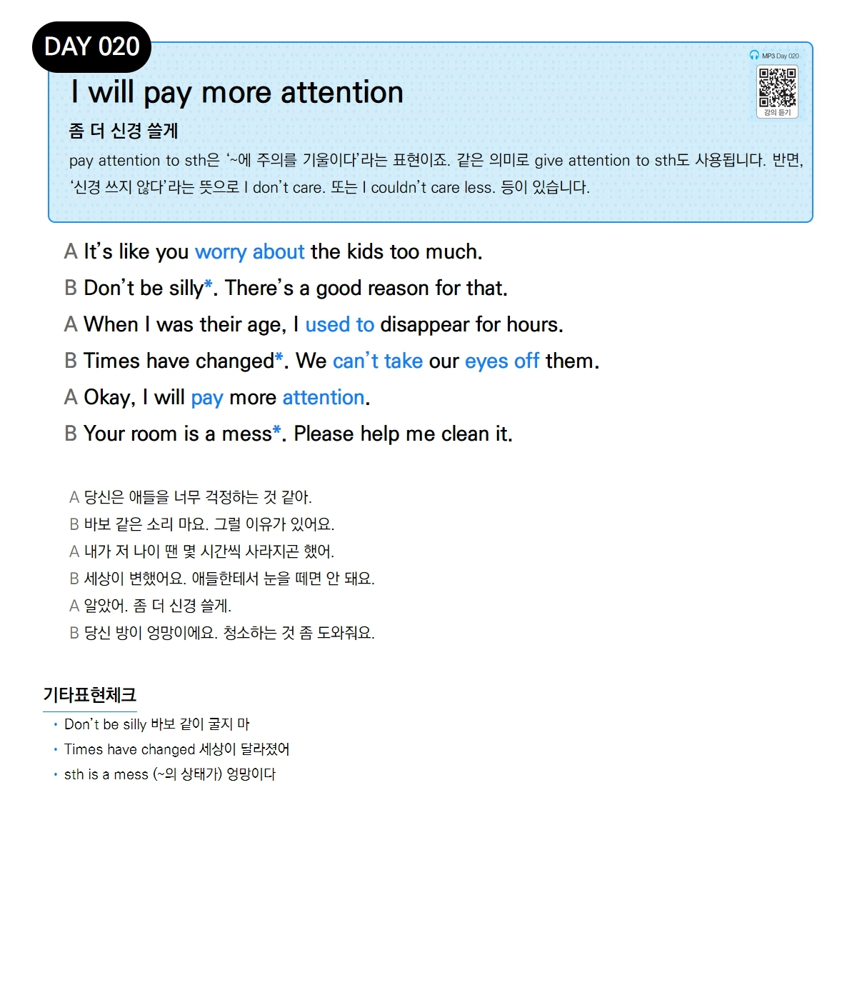

# Day 020 — I will pay more attention

> **좀 더 신경 쓸게**

## 설명
pay attention to sth은 '~에 주의를 기울이다'라는 표현이죠. 같은 의미로 give attention to sth도 사용됩니다. 반면, '신경 쓰지 않다'라는 뜻으로 I don't care. 또는 I couldn't care less. 등이 있습니다.

## 대화

| | English | 한국어 |
|---|---------|--------|
| A | It's like you worry about the kids too much. | 당신은 애들을 너무 걱정하는 것 같아. |
| B | Don't be silly. There's a good reason for that. | 바보 같은 소리 마요. 그럴 이유가 있어요. |
| A | When I was their age, I used to disappear for hours. | 내가 저 나이 땐 몇 시간씩 사라지곤 했어. |
| B | Times have changed. We can't take our eyes off them. | 세상이 변했어요. 애들한테서 눈을 떼면 안 돼요. |
| A | Okay, I will pay more attention. | 알았어. 좀 더 신경 쓸게. |
| B | Your room is a mess. Please help me clean it. | 당신 방이 엉망이에요. 청소하는 것 좀 도와줘요. |

## 기타표현 체크
- **Don't be silly** 바보 같이 굴지 마
- **Times have changed** 세상이 달라졌어
- **sth is a mess** (~의 상태가) 엉망이다
