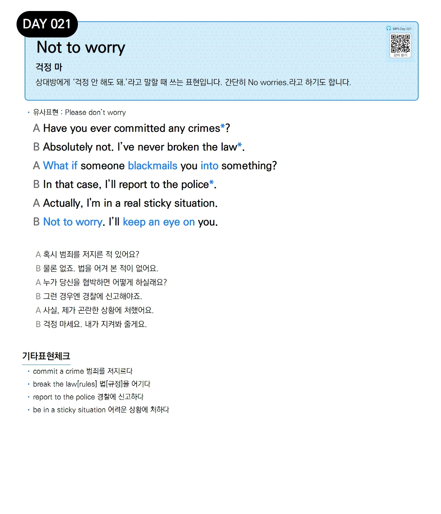

# Day 021 — Not to worry

> **걱정 마**

## 설명
상대방에게 '걱정 안 해도 돼.'라고 말할 때 쓰는 표현입니다. 간단히 No worries.라고 하기도 합니다.

- **유사표현**: Please don't worry

## 대화

| | English | 한국어 |
|---|---------|--------|
| A | Have you ever committed any crimes? | 혹시 범죄를 저지른 적 있어요? |
| B | Absolutely not. I've never broken the law. | 물론 없죠. 법을 어겨 본 적이 없어요. |
| A | What if someone blackmails you into something? | 누가 당신을 협박하면 어떻게 하실래요? |
| B | In that case, I'll report to the police. | 그런 경우엔 경찰에 신고해야죠. |
| A | Actually, I'm in a real sticky situation. | 사실, 제가 곤란한 상황에 처했어요. |
| B | Not to worry. I'll keep an eye on you. | 걱정 마세요. 내가 지켜봐 줄게요. |

## 기타표현 체크
- **commit a crime** 범죄를 저지르다
- **break the law[rules]** 법[규정]을 어기다
- **report to the police** 경찰에 신고하다
- **be in a sticky situation** 어려운 상황에 처하다
