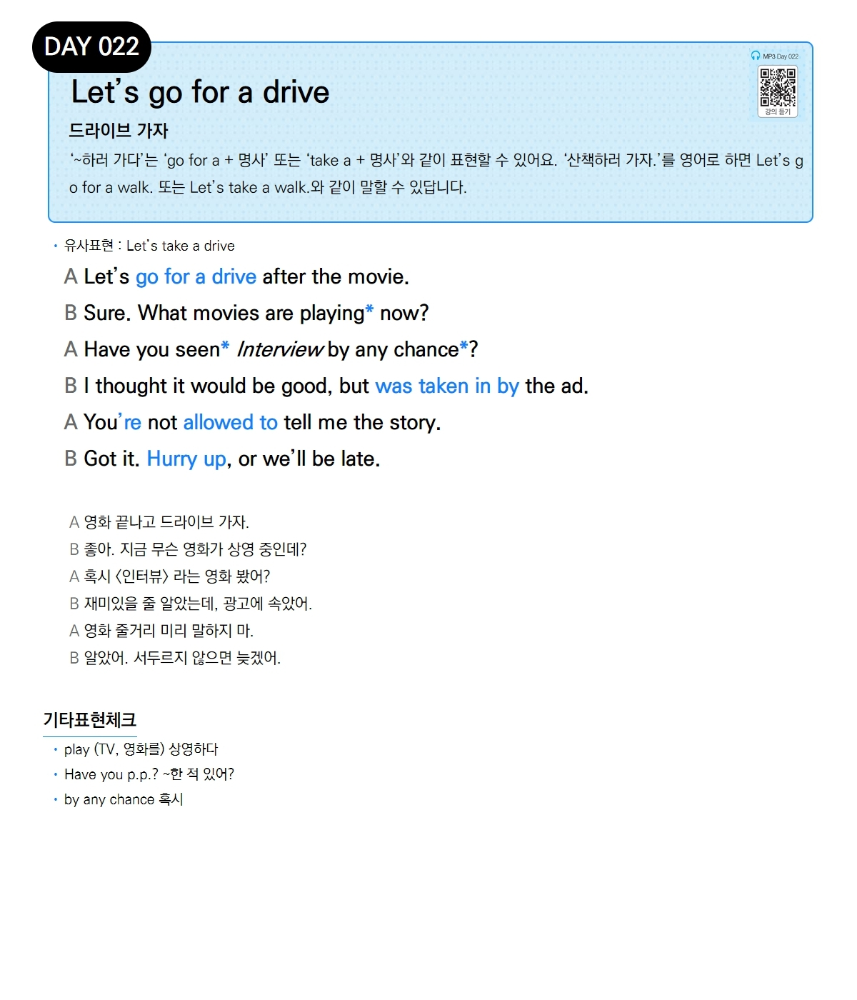

# Day 022 — Let's go for a drive

> **드라이브 가자**

## 설명
'~하러 가다'는 'go for a + 명사' 또는 'take a + 명사'와 같이 표현할 수 있어요. '산책하러 가자.'를 영어로 하면 Let's go for a walk. 또는 Let's take a walk.와 같이 말할 수 있답니다.

- **유사표현**: Let's take a drive

## 대화

| | English | 한국어 |
|---|---------|--------|
| A | Let's go for a drive after the movie. | 영화 끝나고 드라이브 가자. |
| B | Sure. What movies are playing now? | 좋아. 지금 무슨 영화가 상영 중인데? |
| A | Have you seen Interview by any chance? | 혹시 〈인터뷰〉 라는 영화 봤어? |
| B | I thought it would be good, but was taken in by the ad. | 재미있을 줄 알았는데, 광고에 속았어. |
| A | You're not allowed to tell me the story. | 영화 줄거리 미리 말하지 마. |
| B | Got it. Hurry up, or we'll be late. | 알았어. 서두르지 않으면 늦겠어. |

## 기타표현 체크
- **play** (TV, 영화를) 상영하다
- **Have you p.p.?** ~한 적 있어?
- **by any chance** 혹시
