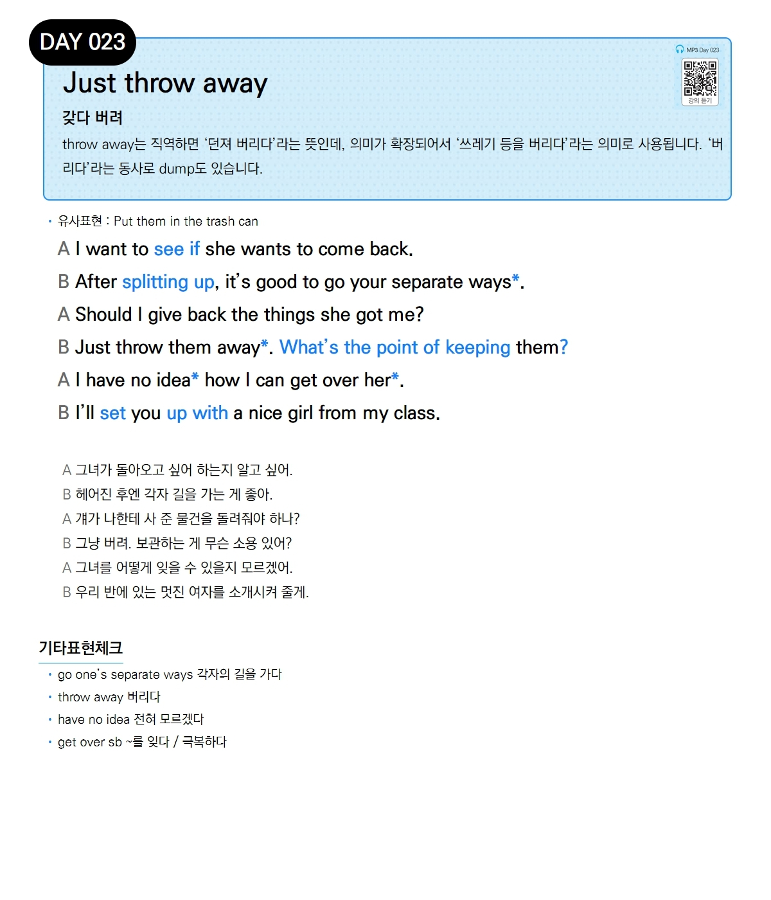

# Day 023 — Just throw away

> **갖다 버려**

## 설명
throw away는 직역하면 '던져 버리다'라는 뜻인데, 의미가 확장되어서 '쓰레기 등을 버리다'라는 의미로 사용됩니다. '버리다'라는 동사로 dump도 있습니다.

- **유사표현**: Put them in the trash can

## 대화

| | English | 한국어 |
|---|---------|--------|
| A | I want to see if she wants to come back. | 그녀가 돌아오고 싶어 하는지 알고 싶어. |
| B | After splitting up, it's good to go your separate ways. | 헤어진 후엔 각자 길을 가는 게 좋아. |
| A | Should I give back the things she got me? | 걔가 나한테 사 준 물건을 돌려줘야 하나? |
| B | Just throw them away. What's the point of keeping them? | 그냥 버려. 보관하는 게 무슨 소용 있어? |
| A | I have no idea how I can get over her. | 그녀를 어떻게 잊을 수 있을지 모르겠어. |
| B | I'll set you up with a nice girl from my class. | 우리 반에 있는 멋진 여자를 소개시켜 줄게. |

## 기타표현 체크
- **go one's separate ways** 각자의 길을 가다
- **throw away** 버리다
- **have no idea** 전혀 모르겠다
- **get over sb** ~를 잊다 / 극복하다
