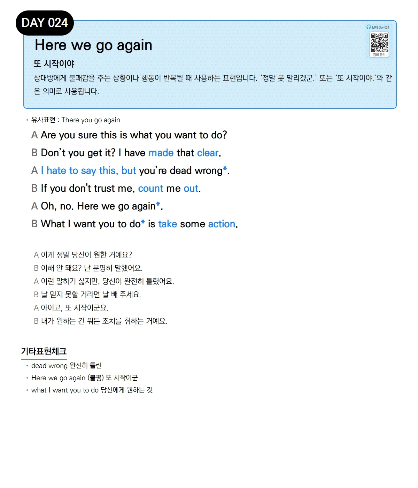

# Day 024 — Here we go again

> **또 시작이야**

## 설명
상대방에게 불쾌감을 주는 상황이나 행동이 반복될 때 사용하는 표현입니다. '정말 못 말리겠군.' 또는 '또 시작이야.'와 같은 의미로 사용됩니다.

- **유사표현**: There you go again

## 대화

| | English | 한국어 |
|---|---------|--------|
| A | Are you sure this is what you want to do? | 이게 정말 당신이 원한 거예요? |
| B | Don't you get it? I have made that clear. | 이해 안 돼요? 난 분명히 말했어요. |
| A | I hate to say this, but you're dead wrong. | 이런 말하기 싫지만, 당신이 완전히 틀렸어요. |
| B | If you don't trust me, count me out. | 날 믿지 못할 거라면 날 빼 주세요. |
| A | Oh, no. Here we go again. | 아이고, 또 시작이군요. |
| B | What I want you to do is take some action. | 내가 원하는 건 뭐든 조치를 취하는 거예요. |

## 기타표현 체크
- **dead wrong** 완전히 틀린
- **Here we go again** (불평) 또 시작이군
- **what I want you to do** 당신에게 원하는 것
