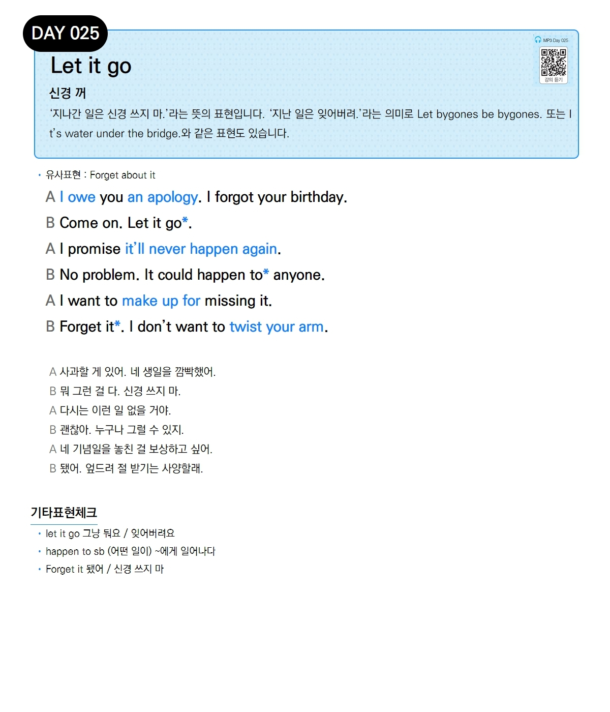

# Day 025 — Let it go

> **신경 꺼**

## 설명
'지나간 일은 신경 쓰지 마.'라는 뜻의 표현입니다. '지난 일은 잊어버려.'라는 의미로 Let bygones be bygones. 또는 It's water under the bridge.와 같은 표현도 있습니다.

- **유사표현**: Forget about it

## 대화

| | English | 한국어 |
|---|---------|--------|
| A | I owe you an apology. I forgot your birthday. | 사과할 게 있어. 네 생일을 깜빡했어. |
| B | Come on. Let it go. | 뭐 그런 걸 다. 신경 쓰지 마. |
| A | I promise it'll never happen again. | 다시는 이런 일 없을 거야. |
| B | No problem. It could happen to anyone. | 괜찮아. 누구나 그럴 수 있지. |
| A | I want to make up for missing it. | 네 기념일을 놓친 걸 보상하고 싶어. |
| B | Forget it. I don't want to twist your arm. | 됐어. 엎드려 절 받기는 사양할래. |

## 기타표현 체크
- **let it go** 그냥 둬요 / 잊어버려요
- **happen to sb** (어떤 일이) ~에게 일어나다
- **Forget it** 됐어 / 신경 쓰지 마
