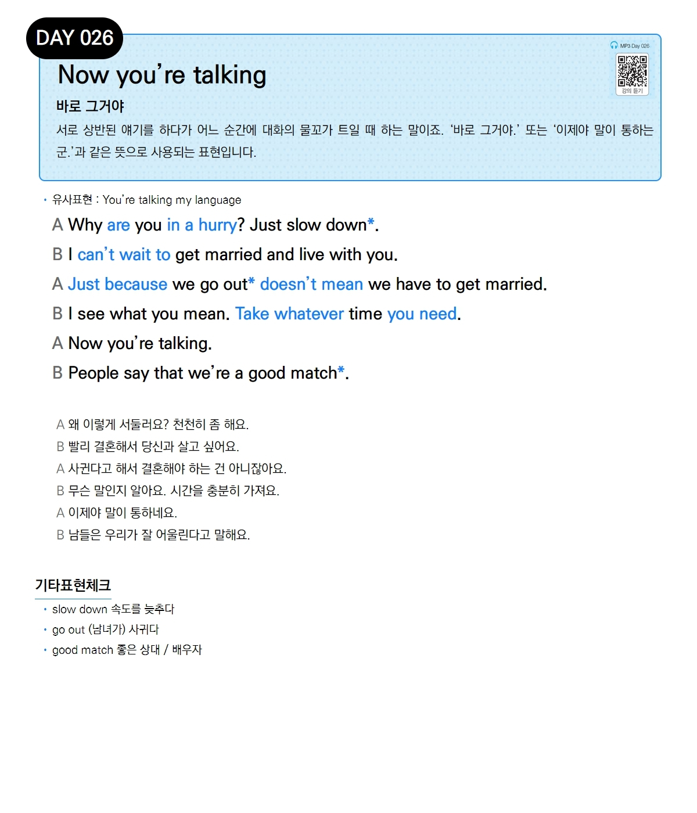

# Day 026 — Now you're talking

> **바로 그거야**

## 설명
서로 상반된 얘기를 하다가 어느 순간에 대화의 물꼬가 트일 때 하는 말이죠. '바로 그거야.' 또는 '이제야 말이 통하는군.'과 같은 뜻으로 사용되는 표현입니다.

- **유사표현**: You're talking my language

## 대화

| | English | 한국어 |
|---|---------|--------|
| A | Why are you in a hurry? Just slow down. | 왜 이렇게 서둘러요? 천천히 좀 해요. |
| B | I can't wait to get married and live with you. | 빨리 결혼해서 당신과 살고 싶어요. |
| A | Just because we go out doesn't mean we have to get married. | 사귄다고 해서 결혼해야 하는 건 아니잖아요. |
| B | I see what you mean. Take whatever time you need. | 무슨 말인지 알아요. 시간을 충분히 가져요. |
| A | Now you're talking. | 이제야 말이 통하네요. |
| B | People say that we're a good match. | 남들은 우리가 잘 어울린다고 말해요. |

## 기타표현 체크
- **slow down** 속도를 늦추다
- **go out** (남녀가) 사귀다
- **good match** 좋은 상대 / 배우자
