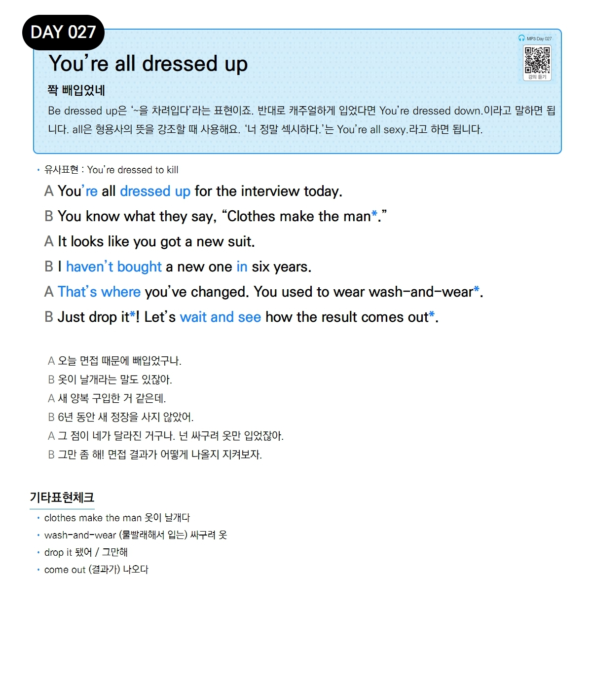

# Day 027 — You're all dressed up

> **쫙 빼입었네**

## 설명
Be dressed up은 '~을 차려입다'라는 표현이죠. 반대로 캐주얼하게 입었다면 You're dressed down.이라고 말하면 됩니다. all은 형용사의 뜻을 강조할 때 사용해요. '너 정말 섹시하다.'는 You're all sexy.라고 하면 됩니다.

- **유사표현**: You're dressed to kill

## 대화

| | English | 한국어 |
|---|---------|--------|
| A | You're all dressed up for the interview today. | 오늘 면접 때문에 빼입었구나. |
| B | You know what they say, "Clothes make the man." | 옷이 날개라는 말도 있잖아. |
| A | It looks like you got a new suit. | 새 양복 구입한 거 같은데. |
| B | I haven't bought a new one in six years. | 6년 동안 새 정장을 사지 않았어. |
| A | That's where you've changed. You used to wear wash-and-wear. | 그 점이 네가 달라진 거구나. 넌 싸구려 옷만 입었잖아. |
| B | Just drop it! Let's wait and see how the result comes out. | 그만 좀 해! 면접 결과가 어떻게 나올지 지켜보자. |

## 기타표현 체크
- **clothes make the man** 옷이 날개다
- **wash-and-wear** (물빨래해서 입는) 싸구려 옷
- **drop it** 됐어 / 그만해
- **come out** (결과가) 나오다
