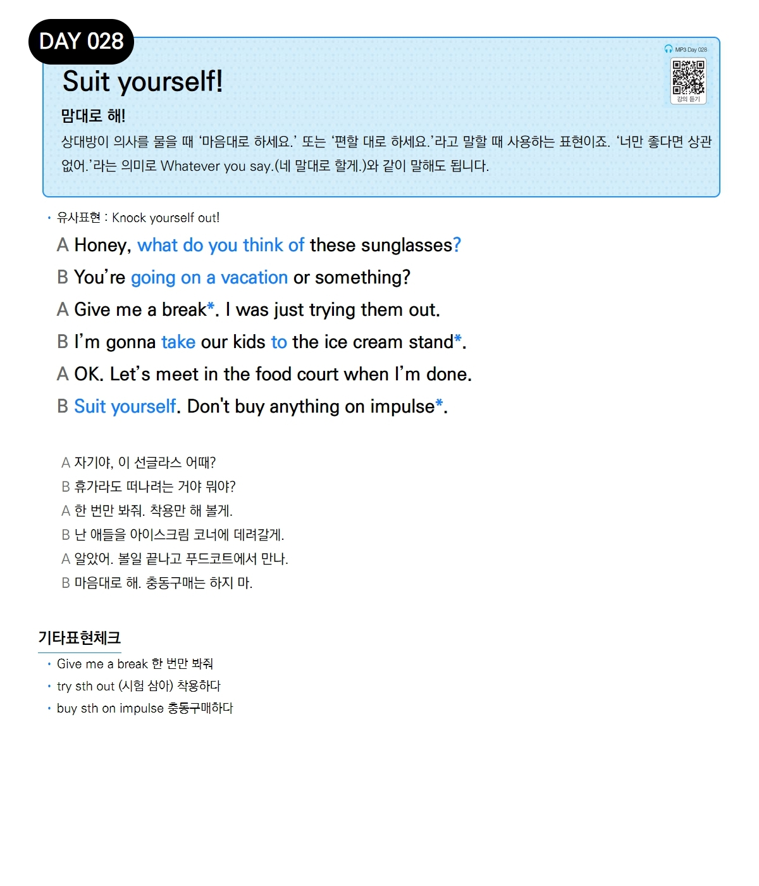

# Day 028 — Suit yourself!

> **맘대로 해!**

## 설명
상대방이 의사를 물을 때 '마음대로 하세요.' 또는 '편할 대로 하세요.'라고 말할 때 사용하는 표현이죠. '너만 좋다면 상관없어.'라는 의미로 `Whatever you say.`(네 말대로 할게.)와 같이 말해도 됩니다.

- **유사표현**: Knock yourself out!

## 대화

| | English | 한국어 |
|---|---------|--------|
| A | Honey, what do you think of these sunglasses? | 자기야, 이 선글라스 어때? |
| B | You're going on a vacation or something? | 휴가라도 떠나려는 거야 뭐야? |
| A | Give me a break. I was just trying them out. | 한 번만 봐줘. 착용만 해 볼게. |
| B | I'm gonna take our kids to the ice cream stand. | 난 애들을 아이스크림 코너에 데려갈게. |
| A | OK. Let's meet in the food court when I'm done. | 알았어. 볼일 끝나고 푸드코트에서 만나. |
| B | Suit yourself. Don't buy anything on impulse. | 마음대로 해. 충동구매는 하지 마. |

## 기타표현 체크
- **Give me a break** 한 번만 봐줘
- **try sth out** (시험 삼아) 착용하다
- **buy sth on impulse** 충동구매하다
