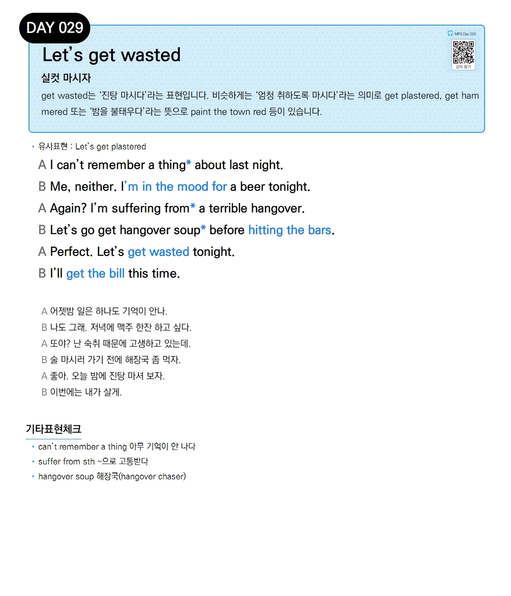

# Day 029 — Let's get wasted

> **실컷 마시자**

## 설명
`get wasted`는 '진탕 마시다'라는 표현입니다. 비슷하게는 '엄청 취하도록 마시다'라는 의미로 `get plastered`, `get hammered` 또는 '밤을 불태우다'라는 뜻으로 `paint the town red` 등이 있습니다.

- **유사표현**: Let's get plastered

## 대화

| | English | 한국어 |
|---|---------|--------|
| A | I can't remember a thing about last night. | 어젯밤 일은 하나도 기억이 안 나. |
| B | Me, neither. I'm in the mood for a beer tonight. | 나도 그래. 저녁에 맥주 한잔 하고 싶다. |
| A | Again? I'm suffering from a terrible hangover. | 또야? 난 숙취 때문에 고생하고 있는데. |
| B | Let's go get hangover soup before hitting the bars. | 술 마시러 가기 전에 해장국 좀 먹자. |
| A | Perfect. Let's get wasted tonight. | 좋아. 오늘 밤에 진탕 마셔 보자. |
| B | I'll get the bill this time. | 이번에는 내가 살게. |

## 기타표현 체크
- **can't remember a thing** 아무 기억이 안 나다
- **suffer from sth** ~으로 고통받다
- **hangover soup** 해장국 (hangover chaser)
