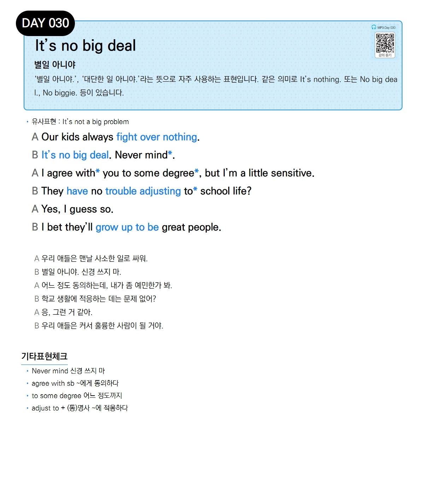

# Day 030 — It's no big deal

> **별일 아니야**

## 설명
'별일 아니야.', '대단한 일 아니야.'라는 뜻으로 자주 사용하는 표현입니다. 같은 의미로 `It's nothing.` 또는 `No big deal.`, `No biggie.` 등이 있습니다.

- **유사표현**: It's not a big problem

## 대화

| | English | 한국어 |
|---|---------|--------|
| A | Our kids always fight over nothing. | 우리 애들은 맨날 사소한 일로 싸워. |
| B | It's no big deal. Never mind. | 별일 아니야. 신경 쓰지 마. |
| A | I agree with you to some degree, but I'm a little sensitive. | 어느 정도 동의하는데, 내가 좀 예민한가 봐. |
| B | They have no trouble adjusting to school life? | 학교 생활에 적응하는 데는 문제 없어? |
| A | Yes, I guess so. | 응, 그런 거 같아. |
| B | I bet they'll grow up to be great people. | 우리 애들은 커서 훌륭한 사람이 될 거야. |

## 기타표현 체크
- **Never mind** 신경 쓰지 마
- **agree with sb** ~에게 동의하다
- **to some degree** 어느 정도까지
- **adjust to + (동)명사** ~에 적응하다
