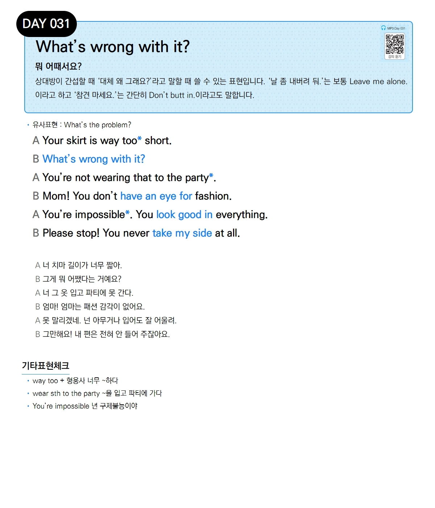

# Day 031 — What's wrong with it?

> **뭐 어때서요?**

## 설명
상대방이 간섭할 때 '대체 왜 그래요?'라고 말할 때 쓸 수 있는 표현입니다. '날 좀 내버려 둬.'는 보통 `Leave me alone.`이라고 하고 '참견 마세요.'는 간단히 `Don't butt in.`이라고도 말합니다.

- **유사표현**: What's the problem?

## 대화

| | English | 한국어 |
|---|---------|--------|
| A | Your skirt is way too short. | 너 치마 길이가 너무 짧아. |
| B | What's wrong with it? | 그게 뭐 어쨌다는 거예요? |
| A | You're not wearing that to the party. | 너 그 옷 입고 파티에 못 간다. |
| B | Mom! You don't have an eye for fashion. | 엄마! 엄마는 패션 감각이 없어요. |
| A | You're impossible. You look good in everything. | 못 말리겠네. 넌 아무거나 입어도 잘 어울려. |
| B | Please stop! You never take my side at all. | 그만해요! 내 편은 전혀 안 들어 주잖아요. |

## 기타표현 체크
- **way too + 형용사** 너무 ~하다
- **wear sth to the party** ~을 입고 파티에 가다
- **You're impossible** 넌 구제불능이야
