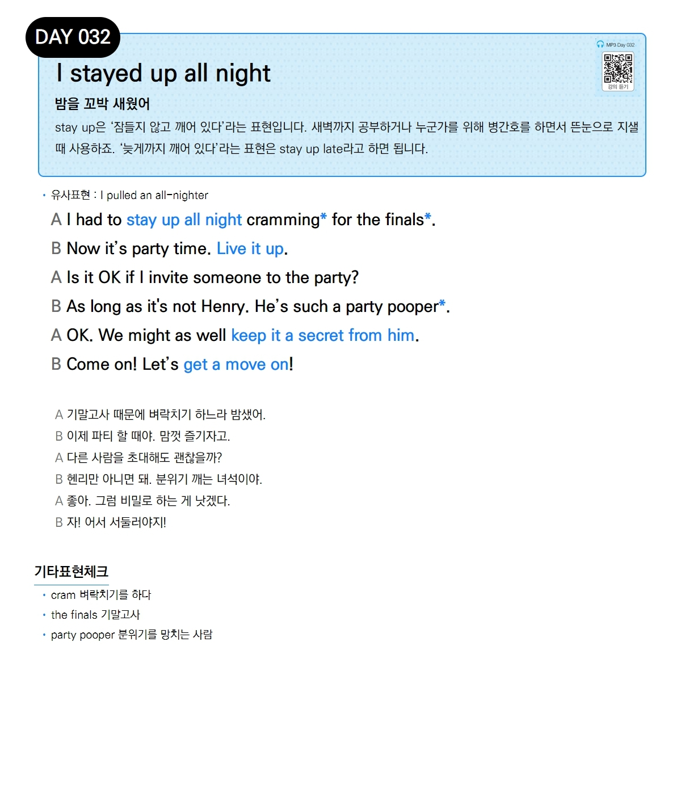

# Day 032 — I stayed up all night

> **밤을 꼬박 새웠어**

## 설명
`stay up`은 '잠들지 않고 깨어 있다'라는 표현입니다. 새벽까지 공부하거나 누군가를 위해 병간호를 하면서 뜬눈으로 지샐 때 사용하죠. '늦게까지 깨어 있다'라는 표현은 `stay up late`라고 하면 됩니다.

- **유사표현**: I pulled an all-nighter

## 대화

| | English | 한국어 |
|---|---------|--------|
| A | I had to stay up all night cramming for the finals. | 기말고사 때문에 벼락치기 하느라 밤샜어. |
| B | Now it's party time. Live it up. | 이제 파티 할 때야. 맘껏 즐기자고. |
| A | Is it OK if I invite someone to the party? | 다른 사람을 초대해도 괜찮을까? |
| B | As long as it's not Henry. He's such a party pooper. | 헨리만 아니면 돼. 분위기 깨는 녀석이야. |
| A | OK. We might as well keep it a secret from him. | 좋아. 그럼 비밀로 하는 게 낫겠다. |
| B | Come on! Let's get a move on! | 자! 어서 서둘러야지! |

## 기타표현 체크
- **cram** 벼락치기를 하다
- **the finals** 기말고사
- **party pooper** 분위기를 망치는 사람
