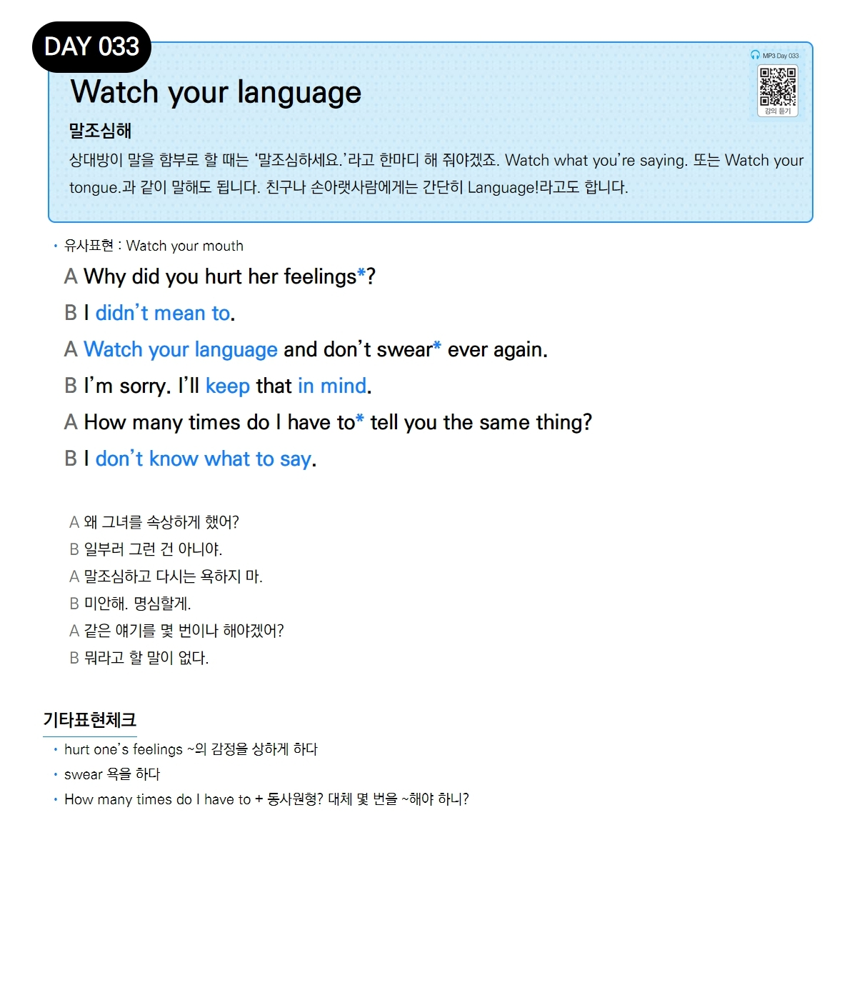

# Day 033 — Watch your language

> **말조심해**

## 설명
상대방이 말을 함부로 할 때는 '말조심하세요.'라고 한마디 해 줘야겠죠. `Watch what you're saying.` 또는 `Watch your tongue.`과 같이 말해도 됩니다. 친구나 손아랫사람에게는 간단히 `Language!`라고도 합니다.

- **유사표현**: Watch your mouth

## 대화

| | English | 한국어 |
|---|---------|--------|
| A | Why did you hurt her feelings? | 왜 그녀를 속상하게 했어? |
| B | I didn't mean to. | 일부러 그런 건 아니야. |
| A | Watch your language and don't swear ever again. | 말조심하고 다시는 욕하지 마. |
| B | I'm sorry. I'll keep that in mind. | 미안해. 명심할게. |
| A | How many times do I have to tell you the same thing? | 같은 얘기를 몇 번이나 해야겠어? |
| B | I don't know what to say. | 뭐라고 할 말이 없다. |

## 기타표현 체크
- **hurt one's feelings** ~의 감정을 상하게 하다
- **swear** 욕을 하다
- **How many times do I have to + 동사원형?** 대체 몇 번을 ~해야 하니?
