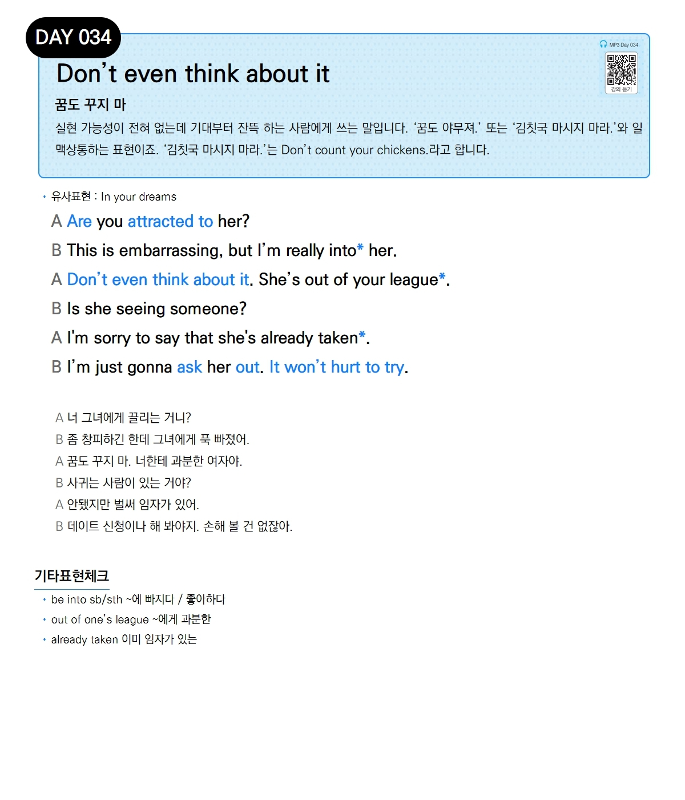

# Day 034 — Don't even think about it

> **꿈도 꾸지 마**

## 설명
실현 가능성이 전혀 없는데 기대부터 잔뜩 하는 사람에게 쓰는 말입니다. '꿈도 야무져.' 또는 '김칫국 마시지 마라.'와 일맥상통하는 표현이죠. '김칫국 마시지 마라.'는 `Don't count your chickens.`라고 합니다.

- **유사표현**: In your dreams

## 대화

| | English | 한국어 |
|---|---------|--------|
| A | Are you attracted to her? | 너 그녀에게 끌리는 거니? |
| B | This is embarrassing, but I'm really into her. | 좀 창피하긴 한데 그녀에게 푹 빠졌어. |
| A | Don't even think about it. She's out of your league. | 꿈도 꾸지 마. 너한테 과분한 여자야. |
| B | Is she seeing someone? | 사귀는 사람이 있는 거야? |
| A | I'm sorry to say that she's already taken. | 안됐지만 벌써 임자가 있어. |
| B | I'm just gonna ask her out. It won't hurt to try. | 데이트 신청이나 해 봐야지. 손해 볼 건 없잖아. |

## 기타표현 체크
- **be into sb/sth** ~에 빠지다 / 좋아하다
- **out of one's league** ~에게 과분한
- **already taken** 이미 임자가 있는
