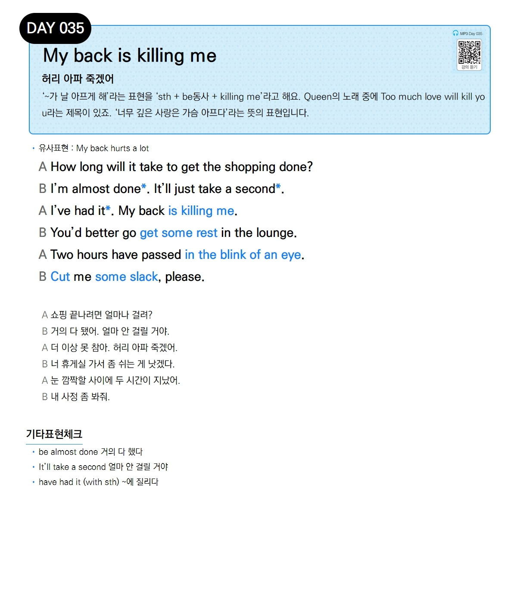

# Day 035 — My back is killing me

> **허리 아파 죽겠어**

## 설명
'~가 날 아프게 해'라는 표현을 'sth + be동사 + killing me'라고 해요. Queen의 노래 중에 Too much love will kill you라는 제목이 있죠. '너무 깊은 사랑은 가슴 아프다'라는 뜻의 표현입니다.

- **유사표현**: My back hurts a lot

## 대화

| | English | 한국어 |
|---|---------|--------|
| A | How long will it take to get the shopping done? | 쇼핑 끝나려면 얼마나 걸려? |
| B | I'm almost done. It'll just take a second. | 거의 다 됐어. 얼마 안 걸릴 거야. |
| A | I've had it. My back is killing me. | 더 이상 못 참아. 허리 아파 죽겠어. |
| B | You'd better go get some rest in the lounge. | 너 휴게실 가서 좀 쉬는 게 낫겠다. |
| A | Two hours have passed in the blink of an eye. | 눈 깜짝할 사이에 두 시간이 지났어. |
| B | Cut me some slack, please. | 내 사정 좀 봐줘. |

## 기타표현 체크
- **be almost done** 거의 다 했다
- **It'll take a second** 얼마 안 걸릴 거야
- **have had it (with sth)** ~에 질리다
