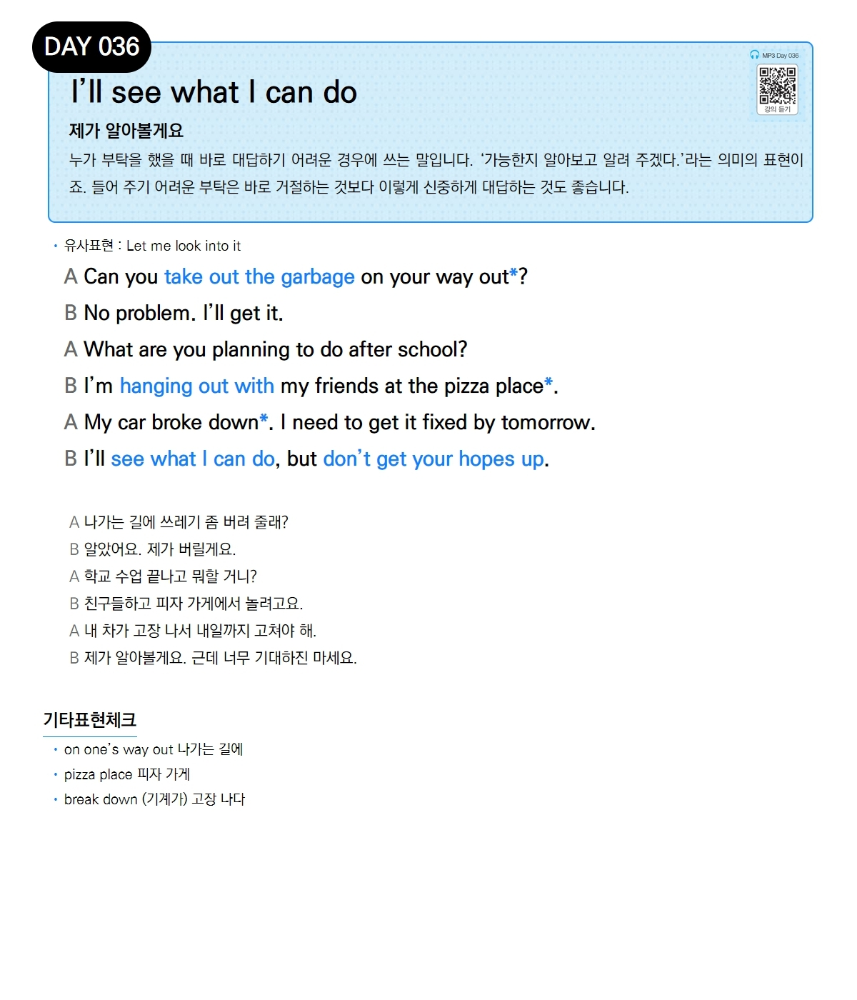

# Day 036 — I'll see what I can do

> **제가 알아볼게요**

## 설명
누가 부탁을 했을 때 바로 대답하기 어려운 경우에 쓰는 말입니다. '가능한지 알아보고 알려 주겠다.'라는 의미의 표현이죠. 들어 주기 어려운 부탁은 바로 거절하는 것보다 이렇게 신중하게 대답하는 것도 좋습니다.

- **유사표현**: Let me look into it

## 대화

| | English | 한국어 |
|---|---------|--------|
| A | Can you take out the garbage on your way out? | 나가는 길에 쓰레기 좀 버려 줄래? |
| B | No problem. I'll get it. | 알았어요. 제가 버릴게요. |
| A | What are you planning to do after school? | 학교 수업 끝나고 뭐할 거니? |
| B | I'm hanging out with my friends at the pizza place. | 친구들하고 피자 가게에서 놀려고요. |
| A | My car broke down. I need to get it fixed by tomorrow. | 내 차가 고장 나서 내일까지 고쳐야 해. |
| B | I'll see what I can do, but don't get your hopes up. | 제가 알아볼게요. 근데 너무 기대하진 마세요. |

## 기타표현 체크
- **on one's way out** 나가는 길에
- **pizza place** 피자 가게
- **break down** (기계가) 고장 나다
