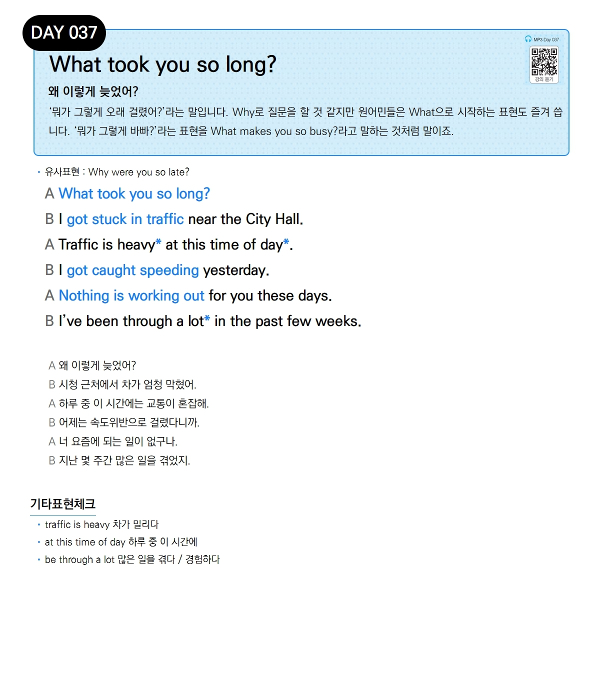

# Day 037 — What took you so long?

> **왜 이렇게 늦었어?**

## 설명
'뭐가 그렇게 오래 걸렸어?'라는 말입니다. Why로 질문을 할 것 같지만 원어민들은 What으로 시작하는 표현도 즐겨 씁니다. '뭐가 그렇게 바빠?'라는 표현을 What makes you so busy?라고 말하는 것처럼 말이죠.

- **유사표현**: Why were you so late?

## 대화

| | English | 한국어 |
|---|---------|--------|
| A | What took you so long? | 왜 이렇게 늦었어? |
| B | I got stuck in traffic near the City Hall. | 시청 근처에서 차가 엄청 막혔어. |
| A | Traffic is heavy at this time of day. | 하루 중 이 시간에는 교통이 혼잡해. |
| B | I got caught speeding yesterday. | 어제는 속도위반으로 걸렸다니까. |
| A | Nothing is working out for you these days. | 너 요즘에 되는 일이 없구나. |
| B | I've been through a lot in the past few weeks. | 지난 몇 주간 많은 일을 겪었지. |

## 기타표현 체크
- **traffic is heavy** 차가 밀리다
- **at this time of day** 하루 중 이 시간에
- **be through a lot** 많은 일을 겪다 / 경험하다
