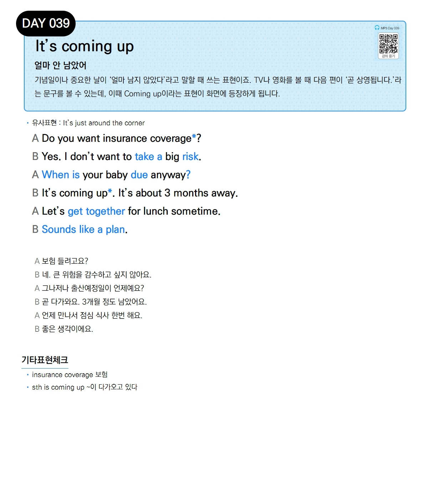

# Day 039 — It's coming up

> **얼마 안 남았어**

## 설명
기념일이나 중요한 날이 '얼마 남지 않았다'라고 말할 때 쓰는 표현이죠. TV나 영화를 볼 때 다음 편이 '곧 상영됩니다.'라는 문구를 볼 수 있는데, 이때 Coming up이라는 표현이 화면에 등장하게 됩니다.

- **유사표현**: It's just around the corner

## 대화

| | English | 한국어 |
|---|---------|--------|
| A | Do you want insurance coverage? | 보험 들려고요? |
| B | Yes. I don't want to take a big risk. | 네. 큰 위험을 감수하고 싶지 않아요. |
| A | When is your baby due anyway? | 그나저나 출산예정일이 언제예요? |
| B | It's coming up. It's about 3 months away. | 곧 다가와요. 3개월 정도 남았어요. |
| A | Let's get together for lunch sometime. | 언제 만나서 점심 식사 한번 해요. |
| B | Sounds like a plan. | 좋은 생각이에요. |

## 기타표현 체크
- **insurance coverage** 보험
- **sth is coming up** ~이 다가오고 있다
