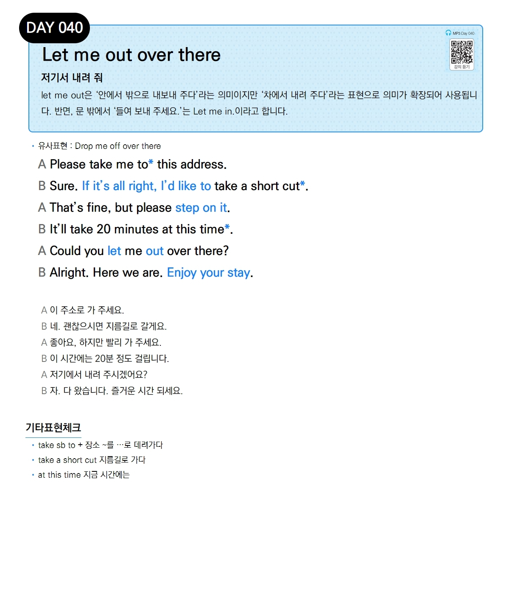

# Day 040 — Let me out over there

> **저기서 내려 줘**

## 설명
let me out은 '안에서 밖으로 내보내 주다'라는 의미이지만 '차에서 내려 주다'라는 표현으로 의미가 확장되어 사용됩니다. 반면, 문 밖에서 '들여 보내 주세요.'는 Let me in.이라고 합니다.

- **유사표현**: Drop me off over there

## 대화

| | English | 한국어 |
|---|---------|--------|
| A | Please take me to this address. | 이 주소로 가 주세요. |
| B | Sure. If it's all right, I'd like to take a short cut. | 네. 괜찮으시면 지름길로 갈게요. |
| A | That's fine, but please step on it. | 좋아요, 하지만 빨리 가 주세요. |
| B | It'll take 20 minutes at this time. | 이 시간에는 20분 정도 걸립니다. |
| A | Could you let me out over there? | 저기에서 내려 주시겠어요? |
| B | Alright. Here we are. Enjoy your stay. | 자. 다 왔습니다. 즐거운 시간 되세요. |

## 기타표현 체크
- **take sb to + 장소** ~를 …로 데려가다
- **take a short cut** 지름길로 가다
- **at this time** 지금 시간에는
