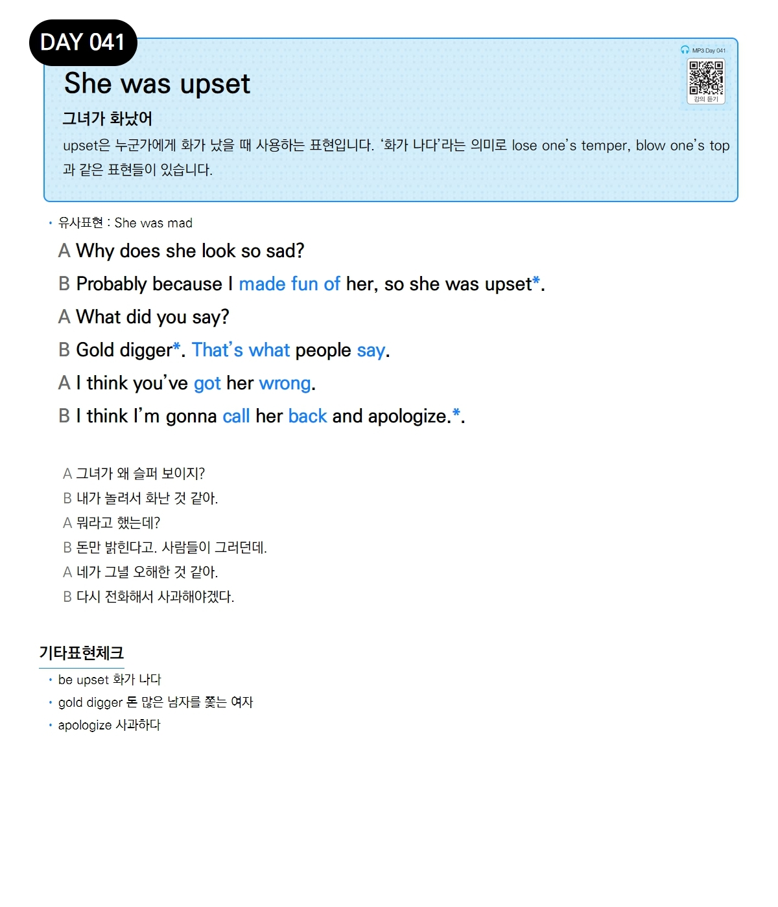

# Day 041 — She was upset

> **그녀가 화났어**

## 설명
upset은 누군가에게 화가 났을 때 사용하는 표현입니다. '화가 나다'라는 의미로 lose one's temper, blow one's top과 같은 표현들이 있습니다.

- **유사표현**: She was mad

## 대화

| | English | 한국어 |
|---|---------|--------|
| A | Why does she look so sad? | 그녀가 왜 슬퍼 보이지? |
| B | Probably because I made fun of her, so she was upset. | 내가 놀려서 화난 것 같아. |
| A | What did you say? | 뭐라고 했는데? |
| B | Gold digger. That's what people say. | 돈만 밝힌다고. 사람들이 그러던데. |
| A | I think you've got her wrong. | 네가 그녀 오해한 것 같아. |
| B | I think I'm gonna call her back and apologize. | 다시 전화해서 사과해야겠다. |

## 기타표현 체크
- **be upset** 화가 나다
- **gold digger** 돈 많은 남자를 쫓는 여자
- **apologize** 사과하다
