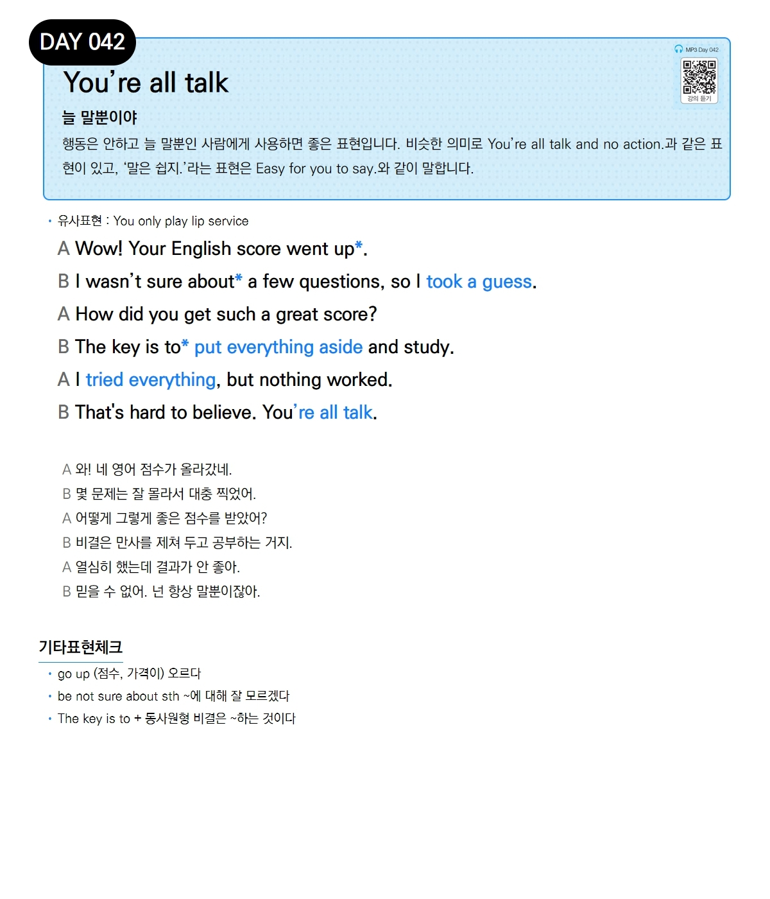

# Day 042 — You're all talk

> **늘 말뿐이야**

## 설명
행동은 안 하고 늘 말뿐인 사람에게 사용하면 좋은 표현입니다. 비슷한 의미로 `You're all talk and no action.`과 같은 표현이 있고, '말은 쉽지.'라는 표현은 `Easy for you to say.`와 같이 말합니다.

- **유사표현**: You only pay lip service

## 대화

| | English | 한국어 |
|---|---------|--------|
| A | Wow! Your English score went up. | 와! 네 영어 점수가 올라갔네. |
| B | I wasn't sure about a few questions, so I took a guess. | 몇 문제는 잘 몰라서 대충 찍었어. |
| A | How did you get such a great score? | 어떻게 그렇게 좋은 점수를 받았어? |
| B | The key is to put everything aside and study. | 비결은 만사를 제쳐 두고 공부하는 거지. |
| A | I tried everything, but nothing worked. | 열심히 했는데 결과가 안 좋아. |
| B | That's hard to believe. You're all talk. | 믿을 수 없어. 넌 항상 말뿐이잖아. |

## 기타표현 체크
- **go up** (점수, 가격이) 오르다
- **be not sure about sth** ~에 대해 잘 모르겠다
- **The key is to + 동사원형** 비결은 ~하는 것이다
