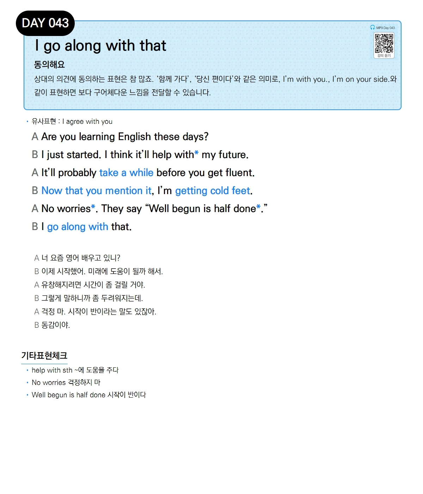

# Day 043 — I go along with that

> **동의해요**

## 설명
상대의 의견에 동의하는 표현은 참 많죠. '함께 가다', '당신 편이다'와 같은 의미로, `I'm with you.`, `I'm on your side.`와 같이 표현하면 보다 구어체다운 느낌을 전달할 수 있습니다.

- **유사표현**: I agree with you

## 대화

| | English | 한국어 |
|---|---------|--------|
| A | Are you learning English these days? | 너 요즘 영어 배우고 있니? |
| B | I just started. I think it'll help with my future. | 이제 시작했어. 미래에 도움이 될까 해서. |
| A | It'll probably take a while before you get fluent. | 유창해지려면 시간이 좀 걸릴 거야. |
| B | Now that you mention it, I'm getting cold feet. | 그렇게 말하니까 좀 두려워지는데. |
| A | No worries. They say "Well begun is half done." | 걱정 마. 시작이 반이라는 말도 있잖아. |
| B | I go along with that. | 동감이야. |

## 기타표현 체크
- **help with sth** ~에 도움을 주다
- **No worries** 걱정하지 마
- **Well begun is half done** 시작이 반이다
