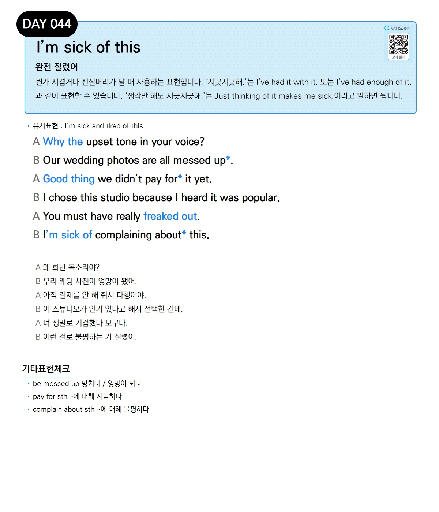

# Day 044 — I'm sick of this

> **완전 질렸어**

## 설명
뭔가 지겹거나 진절머리가 날 때 사용하는 표현입니다. '지긋지긋해.'는 `I've had it with it.` 또는 `I've had enough of it.`과 같이 표현할 수 있습니다. '생각만 해도 지긋지긋해.'는 `Just thinking of it makes me sick.`이라고 말하면 됩니다.

- **유사표현**: I'm sick and tired of this

## 대화

| | English | 한국어 |
|---|---------|--------|
| A | Why the upset tone in your voice? | 왜 화난 목소리야? |
| B | Our wedding photos are all messed up. | 우리 웨딩 사진이 엉망이 됐어. |
| A | Good thing we didn't pay for it yet. | 아직 결제를 안 해 줘서 다행이야. |
| B | I chose this studio because I heard it was popular. | 이 스튜디오가 인기 있다고 해서 선택한 건데. |
| A | You must have really freaked out. | 너 정말로 기겁했나 보구나. |
| B | I'm sick of complaining about this. | 이런 걸로 불평하는 거 질렸어. |

## 기타표현 체크
- **be messed up** 망치다 / 엉망이 되다
- **pay for sth** ~에 대해 지불하다
- **complain about sth** ~에 대해 불평하다
