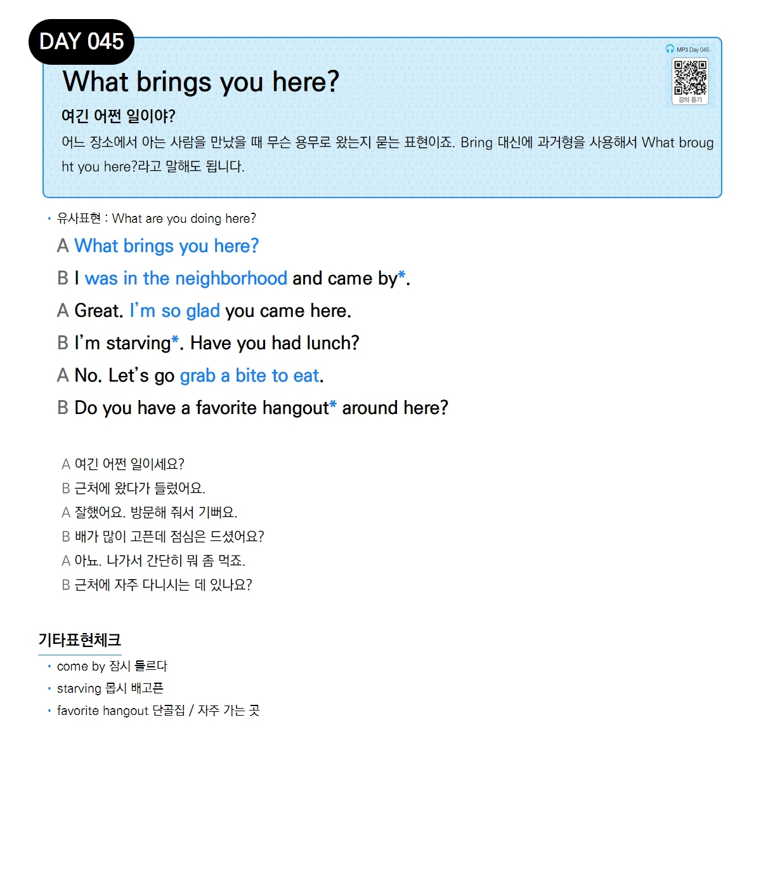

# Day 045 — What brings you here?

> **여긴 어쩐 일이야?**

## 설명
어느 장소에서 아는 사람을 만났을 때 무슨 용무로 왔는지 묻는 표현이죠. `bring` 대신에 과거형을 사용해서 `What brought you here?`라고 말해도 됩니다.

- **유사표현**: What are you doing here?

## 대화

| | English | 한국어 |
|---|---------|--------|
| A | What brings you here? | 여긴 어쩐 일이세요? |
| B | I was in the neighborhood and came by. | 근처에 왔다가 들렀어요. |
| A | Great. I'm so glad you came here. | 잘했어요. 방문해 줘서 기뻐요. |
| B | I'm starving. Have you had lunch? | 배가 많이 고픈데 점심은 드셨어요? |
| A | No. Let's go grab a bite to eat. | 아뇨. 나가서 간단히 뭐 좀 먹죠. |
| B | Do you have a favorite hangout around here? | 근처에 자주 다니시는 데 있나요? |

## 기타표현 체크
- **come by** 잠시 들르다
- **starving** 몹시 배고픈
- **favorite hangout** 단골집 / 자주 가는 곳
