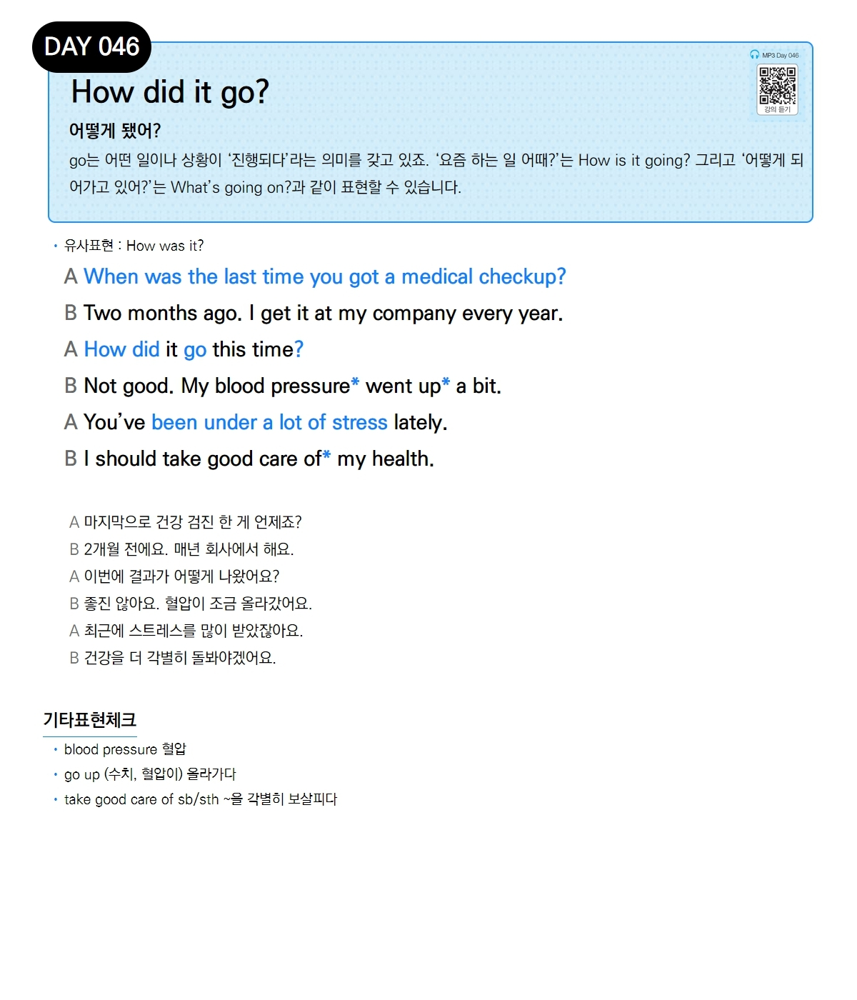

# Day 046 — How did it go?

> **어떻게 됐어?**

## 설명
`go`는 어떤 일이나 상황이 '진행되다'라는 의미를 갖고 있죠. '요즘 하는 일 어때?'는 `How is it going?` 그리고 '어떻게 되어가고 있어?'는 `What's going on?`과 같이 표현할 수 있습니다.

- **유사표현**: How was it?

## 대화

| | English | 한국어 |
|---|---------|--------|
| A | When was the last time you got a medical checkup? | 마지막으로 건강 검진 한 게 언제죠? |
| B | Two months ago. I get it at my company every year. | 2개월 전에요. 매년 회사에서 해요. |
| A | How did it go this time? | 이번에 결과가 어떻게 나왔어요? |
| B | Not good. My blood pressure went up a bit. | 좋진 않아요. 혈압이 조금 올라갔어요. |
| A | You've been under a lot of stress lately. | 최근에 스트레스를 많이 받았잖아요. |
| B | I should take good care of my health. | 건강을 더 각별히 돌봐야겠어요. |

## 기타표현 체크
- **blood pressure** 혈압
- **go up** (수치, 혈압이) 올라가다
- **take good care of sb/sth** ~을 각별히 보살피다
