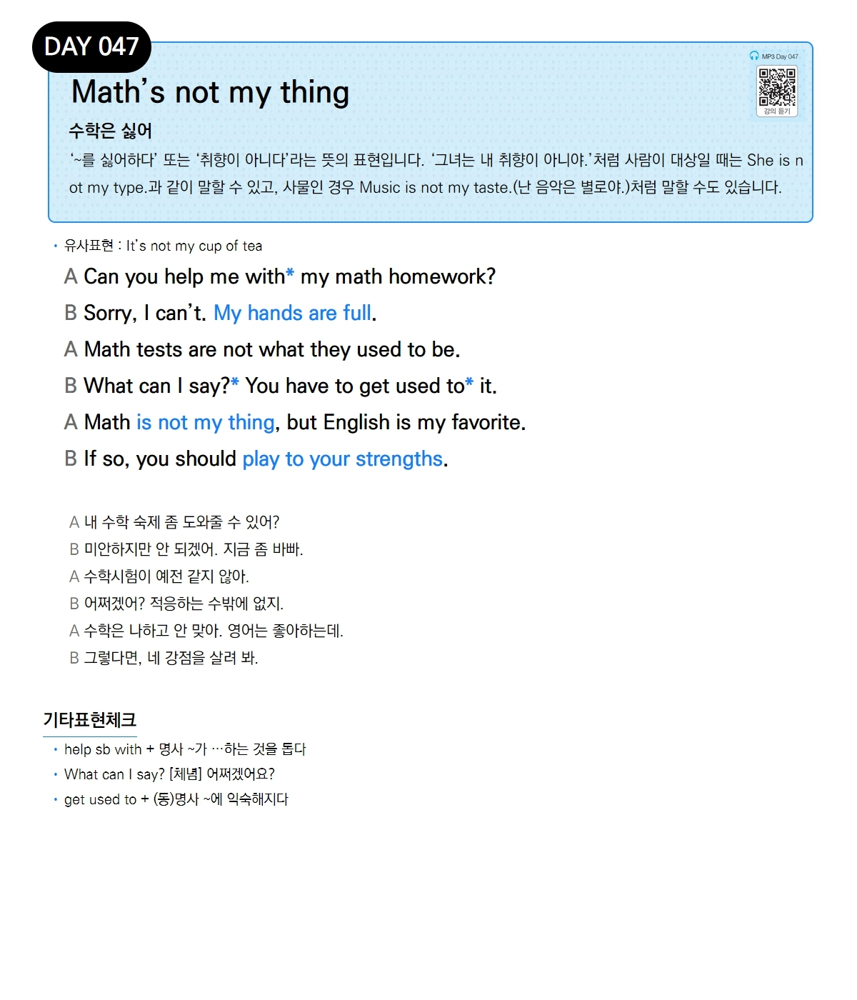

# Day 047 — Math's not my thing

> **수학은 싫어**

## 설명
'~를 싫어하다' 또는 '취향이 아니다'라는 뜻의 표현입니다. '그녀는 내 취향이 아니야.'처럼 사람이 대상일 때는 `She is not my type.`과 같이 말할 수 있고, 사물인 경우 `Music is not my taste.`(난 음악은 별로야.)처럼 말할 수도 있습니다.

- **유사표현**: It's not my cup of tea

## 대화

| | English | 한국어 |
|---|---------|--------|
| A | Can you help me with my math homework? | 내 수학 숙제 좀 도와줄 수 있어? |
| B | Sorry, I can't. My hands are full. | 미안하지만 안 되겠어. 지금 좀 바빠. |
| A | Math tests are not what they used to be. | 수학시험이 예전 같지 않아. |
| B | What can I say? You have to get used to it. | 어쩌겠어? 적응하는 수밖에 없지. |
| A | Math is not my thing, but English is my favorite. | 수학은 나하고 안 맞아. 영어는 좋아하는데. |
| B | If so, you should play to your strengths. | 그렇다면, 네 강점을 살려 봐. |

## 기타표현 체크
- **help sb with + 명사** ~가 …하는 것을 돕다
- **What can I say?** [체념] 어쩌겠어요?
- **get used to + (동)명사** ~에 익숙해지다
