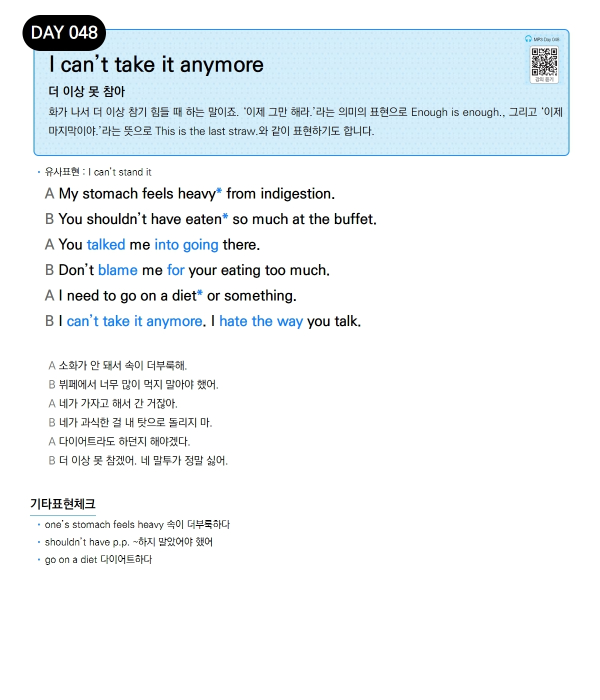

# Day 048 — I can't take it anymore

> **더 이상 못 참아**

## 설명
화가 나서 더 이상 참기 힘들 때 하는 말이죠. '이제 그만 해라.'라는 의미의 표현으로 `Enough is enough.`, 그리고 '이제 마지막이야.'라는 뜻으로 `This is the last straw.`와 같이 표현하기도 합니다.

- **유사표현**: I can't stand it

## 대화

| | English | 한국어 |
|---|---------|--------|
| A | My stomach feels heavy from indigestion. | 소화가 안 돼서 속이 더부룩해. |
| B | You shouldn't have eaten so much at the buffet. | 뷔페에서 너무 많이 먹지 말아야 했어. |
| A | You talked me into going there. | 네가 가자고 해서 간 거잖아. |
| B | Don't blame me for your eating too much. | 네가 과식한 걸 내 탓으로 돌리지 마. |
| A | I need to go on a diet or something. | 다이어트라도 하던지 해야겠다. |
| B | I can't take it anymore. I hate the way you talk. | 더 이상 못 참겠어. 네 말투가 정말 싫어. |

## 기타표현 체크
- **one's stomach feels heavy** 속이 더부룩하다
- **shouldn't have p.p.** ~하지 말았어야 했어
- **go on a diet** 다이어트하다
