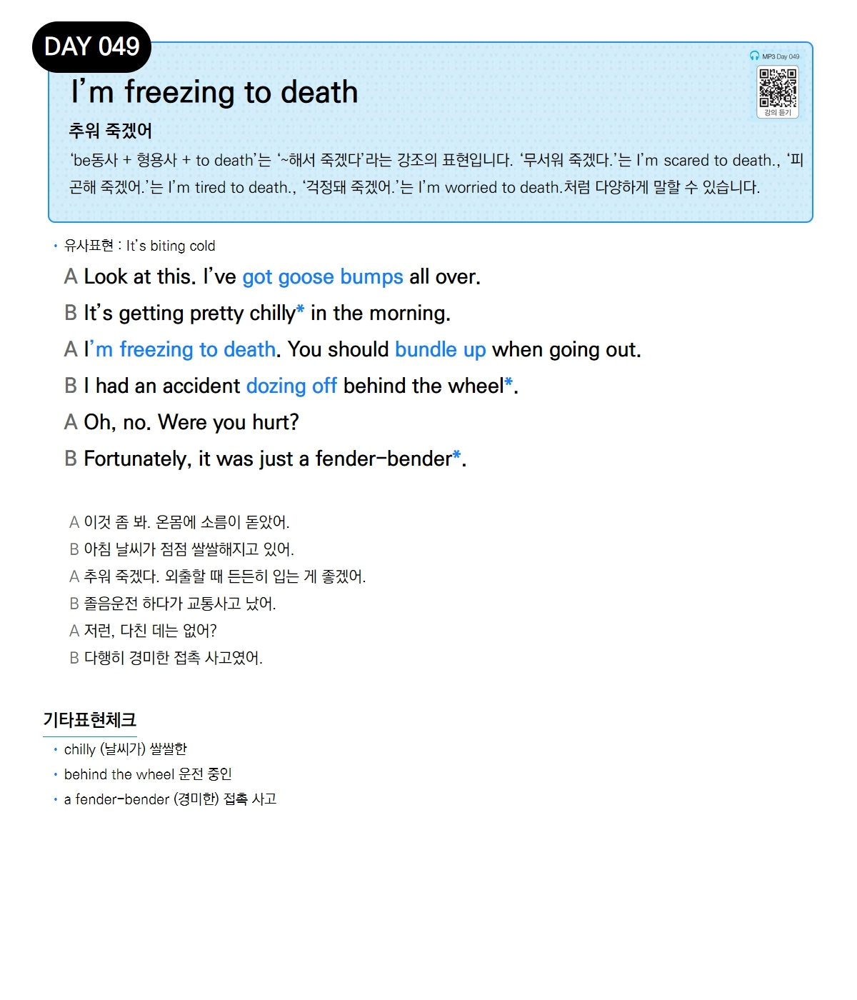

# Day 049 — I'm freezing to death

> **추워 죽겠어**

## 설명
`be동사 + 형용사 + to death`는 '~해서 죽겠다'라는 강조의 표현입니다. '무서워 죽겠다.'는 `I'm scared to death.`, '피곤해 죽겠어.'는 `I'm tired to death.`, '걱정돼 죽겠어.'는 `I'm worried to death.`처럼 다양하게 말할 수 있습니다.

- **유사표현**: It's biting cold

## 대화

| | English | 한국어 |
|---|---------|--------|
| A | Look at this. I've got goose bumps all over. | 이것 좀 봐. 온몸에 소름이 돋았어. |
| B | It's getting pretty chilly in the morning. | 아침 날씨가 점점 쌀쌀해지고 있어. |
| A | I'm freezing to death. You should bundle up when going out. | 추워 죽겠다. 외출할 때 든든히 입는 게 좋겠어. |
| B | I had an accident dozing off behind the wheel. | 졸음운전 하다가 교통사고 났어. |
| A | Oh, no. Were you hurt? | 저런, 다친 데는 없어? |
| B | Fortunately, it was just a fender-bender. | 다행히 경미한 접촉 사고였어. |

## 기타표현 체크
- **chilly** (날씨가) 쌀쌀한
- **behind the wheel** 운전 중인
- **a fender-bender** (경미한) 접촉 사고
