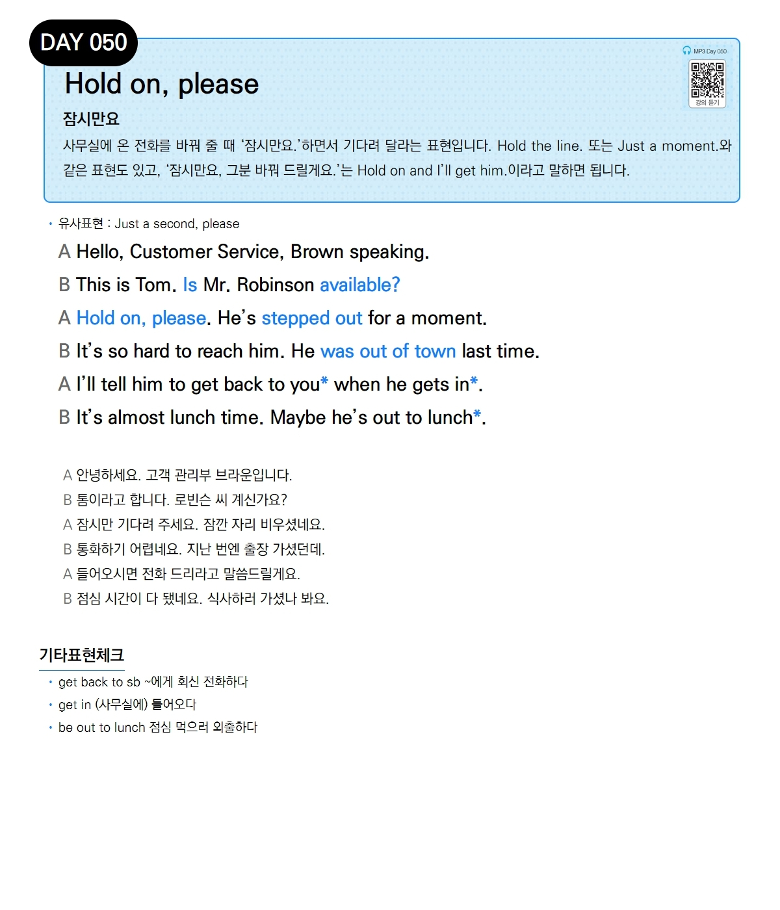

# Day 050 — Hold on, please

> **잠시만요**

## 설명
사무실에 온 전화를 바꿔 줄 때 '잠시만요.'하면서 기다려 달라는 표현입니다. `Hold the line.` 또는 `Just a moment.`와 같은 표현도 있고, '잠시만요, 그분 바꿔 드릴게요.'는 `Hold on and I'll get him.`이라고 말하면 됩니다.

- **유사표현**: Just a second, please

## 대화

| | English | 한국어 |
|---|---------|--------|
| A | Hello, Customer Service, Brown speaking. | 안녕하세요. 고객 관리부 브라운입니다. |
| B | This is Tom. Is Mr. Robinson available? | 톰이라고 합니다. 로빈슨 씨 계신가요? |
| A | Hold on, please. He's stepped out for a moment. | 잠시만 기다려 주세요. 잠깐 자리 비우셨네요. |
| B | It's so hard to reach him. He was out of town last time. | 통화하기 어렵네요. 지난 번엔 출장 가셨던데. |
| A | I'll tell him to get back to you when he gets in. | 들어오시면 전화 드리라고 말씀드릴게요. |
| B | It's almost lunch time. Maybe he's out to lunch. | 점심 시간이 다 됐네요. 식사하러 가셨나 봐요. |

## 기타표현 체크
- **get back to sb** ~에게 회신 전화하다
- **get in** (사무실에) 들어오다
- **be out to lunch** 점심 먹으러 외출하다
