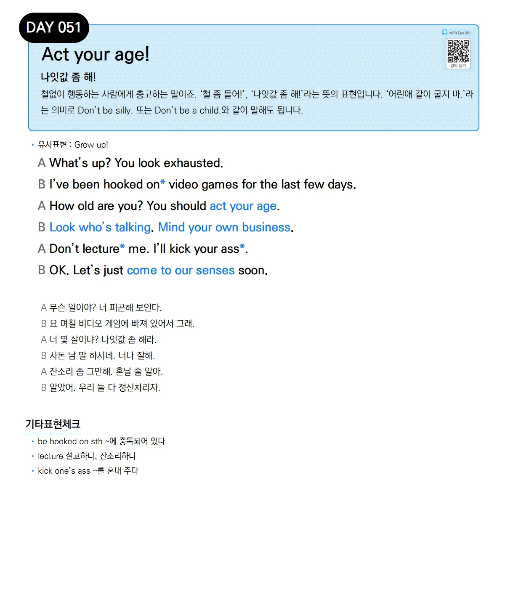

# Day 051 — Act your age!

> **나잇값 좀 해!**

## 설명
철없이 행동하는 사람에게 충고하는 말이죠. '철 좀 들어!', '나잇값 좀 해!'라는 뜻의 표현입니다. '어린애 같이 굴지 마.'라는 의미로 `Don't be silly.` 또는 `Don't be a child.`와 같이 말해도 됩니다.

- **유사표현**: Grow up!

## 대화

| | English | 한국어 |
|---|---------|--------|
| A | What's up? You look exhausted. | 무슨 일이야? 너 피곤해 보인다. |
| B | I've been hooked on video games for the last few days. | 요 며칠 비디오 게임에 빠져 있어서 그래. |
| A | How old are you? You should act your age. | 너 몇 살이냐? 나잇값 좀 해라. |
| B | Look who's talking. Mind your own business. | 사돈 남 말 하시네. 너나 잘해. |
| A | Don't lecture me. I'll kick your ass. | 잔소리 좀 그만해. 혼날 줄 알아. |
| B | OK. Let's just come to our senses soon. | 알았어. 우리 둘 다 정신차리자. |

## 기타표현 체크
- **be hooked on sth** ~에 중독되어 있다
- **lecture** 설교하다, 잔소리하다
- **kick one's ass** ~를 혼내 주다
